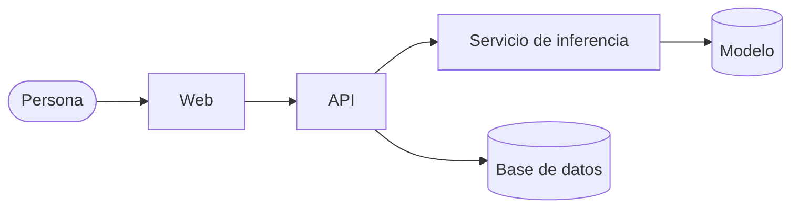

# Mindloom

**Organización inteligente del conocimiento técnico.**

Mindloom ingiere contenido técnico —documentación, artículos, cursos, apuntes,
tutoriales— y lo organiza automáticamente: identifica su categoría, extrae
palabras clave, encuentra contenidos relacionados y permite búsqueda semántica.

No es solo un clasificador: es una **base de conocimiento que crece**. Cada
contenido que entra queda indexado y es inmediatamente recomendable para los
siguientes.

## 🎯 El problema

Quien trabaja o estudia tecnología acumula documentación, artículos y apuntes de
fuentes distintas, en dos idiomas, sin ningún criterio común. Encontrar algo que
se leyó hace tres meses, o notar que dos artículos tratan el mismo tema con
palabras distintas, depende de la memoria de quien los guardó. Mindloom traslada
esa organización de la memoria de una persona a un índice que cualquiera puede
consultar.

## 💡 Qué hace

- 📚**Clasificación temática** — asigna cada contenido a una de 8 categorías.
- 🔑**Extracción de palabras clave** — identifica los términos más relevantes.
- 🔗**Contenidos relacionados** — recomienda material semánticamente parecido.
- 🔍**Búsqueda semántica** — encuentra por significado, no solo por coincidencia de palabras.
- 🗺️**Mapa del conocimiento** — visualiza todo el corpus en 2D, coloreado por categoría.
- 📈**Base que crece** — indexado incremental: cada nuevo contenido enriquece las recomendaciones.

## 🧩 Categorías

Backend · Frontend · Móvil · Datos e IA · DevOps y Cloud · Bases de datos ·
Seguridad · Fundamentos

Una sola categoría por contenido. Las ocho salen del propio corpus, no de una
lista arbitraria: agrupan el volumen real de contenido técnico usado para
entrenar el modelo.

## Cómo funciona



Alguien pega un artículo en la web. La API recibe el texto y se lo pasa al
servicio de inferencia, que lo clasifica y lo convierte en una representación
numérica de su significado (un embedding). La API guarda el contenido, su
categoría, sus palabras clave y ese embedding en la base de datos.

A partir de ahí, ese contenido ya es candidato a aparecer como "relacionado" la
próxima vez que alguien busque algo parecido — sea por texto libre o porque otro
contenido nuevo se le acerca en significado. La comparación de significados la
resuelve la propia base de datos, no un proceso aparte: por eso el corpus
completo, y no solo una muestra, entra en cada búsqueda.

## El repositorio

| Carpeta | Qué hay | Stack |
|---|---|---|
| [api/](api/) | API REST: valida, orquesta y persiste; expone los endpoints públicos. | Java · Spring Boot |
| [inference/](inference/) | Servicio de inferencia: embeddings, clasificación y similitud. | Python · FastAPI |
| [web/](web/) | Interfaz web: ingesta, búsqueda y mapa del corpus. | React · Vite |
| [data/](data/) | Construcción del corpus: extracción, limpieza y etiquetado. | Python |
| [notebook/](notebook/) | Entrenamiento y evaluación; serializa el modelo y el índice del corpus. | Python · scikit-learn · sentence-transformers |
| [scripts/](scripts/) | Herramientas operativas de un solo uso (sembrar la base de datos). | Python |

Infraestructura: Docker, Oracle Autonomous Database (AI Vector Search), Oracle
Cloud Infrastructure (OCI). Los identificadores de esa infraestructura —el
bucket, los alias de conexión, el paquete Java— conservan el nombre histórico
`techmind`: son recursos ya creados en OCI y renombrarlos los rompería sin
ganar nada.

## Empezar

Requisitos: **Docker**. Además Node 22 y pnpm 11 si vas a desarrollar la web con
recarga en caliente, la única pieza que no corre en contenedor.

```bash
cp .env.example .env       # y rellenar
docker compose up          # levanta api + inference
```

`api` e `inference` necesitan dos cosas que no están en el repo: el wallet de la
Autonomous Database y el `model.joblib` del bucket. Dónde vive cada uno en tu
máquina se declara en `docker-compose.override.yml`, que Docker Compose fusiona
solo y que está fuera del control de versiones — las rutas son de cada quien.
Los README de [api/](api/) e [inference/](inference/) traen el detalle.

La web es la única pieza que en local no corre en contenedor: `cd web && pnpm dev`.
El servicio `web` de compose sirve el bundle de producción con nginx y TLS, y
necesita el Certificado de Origen de Cloudflare, que solo está en la VM — ver
[web/README.md](web/README.md).

Cada carpeta documenta su propia configuración, sus variables de entorno y sus
pruebas en su README — ver la tabla de arriba.

## Cómo contribuir

El flujo de ramas, la convención de commits y las reglas de cada capa están en
[CONTRIBUTING.md](CONTRIBUTING.md).

## Licencia

MIT — ver [LICENSE](LICENSE).
