# Arquitectura — Mindloom API (C4 nivel 3: componentes)

Este documento diseca la API por **componentes** (nivel 3 del modelo C4): los
contenedores son la web, la API (`techapi`, Spring Boot), `inference` (FastAPI) y
la Oracle Autonomous Database; dentro de la API se ven los componentes que la
forman.

> ⚠️ **Mermaid no tiene notación C4 nativa.** Este diagrama es **estilo C4**:
> un `flowchart LR` con un `subgraph` por contenedor. Las flechas son llamadas
> síncronas (HTTP o JDBC); la flecha punteada indica cross-cutting.

---

## 1. Diagrama de componentes (estilo C4)

```mermaid
flowchart LR
    subgraph Web["🖥️ Web (React)"]
        UI["SPA React<br/>traduce claves → etiquetas ES"]
    end

    subgraph API["☕ API — techapi (Spring Boot)"]
        direction TB
        subgraph CTL["Controllers"]
            C1["ContentIngestionController<br/>POST /content"]
            C2["ContentQueryController<br/>GET /contents · GET /contents/{id}"]
            C3["RelatedContentController<br/>GET /contents/{id}/related"]
            C4["SearchController<br/>GET /search"]
            C5["MapController<br/>GET /map"]
            C6["StatsController<br/>GET /stats"]
            C7["ModelController<br/>GET /model"]
            C8["BatchUploadController<br/>POST /contents/batch"]
            C9["SeedController<br/>POST /admin/seed"]
            C10["HealthController<br/>GET /health (@Hidden)"]
        end
        subgraph SCORE["Servicios core"]
            S1["ContentQueryServiceImpl"]
            S2["RelatedContentServiceImpl"]
            S3["MapServiceImpl"]
            S4["StatsServiceImpl"]
            S5["KeywordSearchServiceImpl"]
            S6["CorpusSeedServiceImpl"]
            S7["CorpusBatchProcessor<br/>@Transactional REQUIRES_NEW"]
        end
        subgraph SINF["Servicios inference"]
            S8["ContentIngestionServiceImpl<br/>@Transactional"]
            S9["SemanticSearchServiceImpl"]
            S10["BatchUploadServiceImpl"]
            S11["ModelServiceImpl<br/>sin @ConditionalOnProperty"]
        end
        subgraph DATA["Acceso a datos"]
            D1["ContentRepository<br/>JPA + SQL nativo VECTOR"]
            D2["JdbcTemplate<br/>UPDATE embedding · SELECT 1"]
            D3["StringListConverter<br/>List&lt;String&gt; ↔ CLOB JSON"]
            D4["Flyway V1/V2<br/>ddl-auto=validate"]
        end
        subgraph CLIENT["Cliente inference"]
            L1["InferenceClientImpl (RestClient)"]
            L2["RestClientConfig<br/>SNAKE_CASE · JdkClientHttpRequestFactory"]
            L3["InferenceProperties<br/>5 s connect · 30 s read"]
        end
        subgraph XC["Cross-cutting"]
            X1["GlobalExceptionHandler<br/>{error, message, timestamp}"]
            X2["RequestLoggingFilter<br/>OncePerRequestFilter"]
            X3["CorsConfig /**"]
        end
    end

    subgraph INF["🐍 inference (FastAPI :8000)"]
        F1["FastAPI<br/>/predict · /embed · /model/info · /health"]
        M1["Modelo E5<br/>multilingual-e5-small · dim 384"]
    end

    subgraph DB["🗄️ Oracle ADB (Autonomous Database)"]
        O1["contents<br/>VECTOR(384, FLOAT32)"]
    end

    UI -->|"HTTP (JSON)"| API
    CTL -->|"Optional&lt;Service&gt; → 503 si scaffold"| SCORE
    CTL -->|"Optional&lt;Service&gt; → 503 si scaffold"| SINF
    SCORE -->|"solo perfil db"| DATA
    SINF -->|"ingesta · búsqueda"| DATA
    SINF -->|"predict · embed"| CLIENT
    CLIENT -->|"HTTP via RestClient<br/>POST /predict · /embed · GET /model/info · /health"| INF
    DATA -->|"JDBC + SQL nativo VECTOR<br/>VECTOR_DISTANCE · TO_VECTOR · VECTOR_SERIALIZE"| DB
    D4 -->|"Flyway migrations<br/>classpath:db/migration"| DB
    F1 -->|"interno"| M1
    XC -.->|"envuelve cada request"| CTL
```

Leyenda de las cuatro relaciones entre contenedores:

| Relación | Transporte | Notas |
|---|---|---|
| Web → API | HTTP (JSON) | `camelCase` en el contrato público |
| API → inference | HTTP via `RestClient` | `snake_case` en el contrato interno; lo ejecuta `InferenceClientImpl` (bean `inferenceRestClient` de `RestClientConfig`) |
| API → Oracle ADB | JDBC + SQL nativo `VECTOR` | `VECTOR_DISTANCE` / `TO_VECTOR` / `VECTOR_SERIALIZE` en `ContentRepository`; `JdbcTemplate` escribe el embedding |
| API → Oracle ADB (migraciones) | Flyway | `classpath:db/migration`, sufijo `.sql`, `ddl-auto=validate` |
| inference → modelo | interno | FastAPI carga el modelo E5 en su propio proceso; la API no lo ve |

---

## 2. Tabla de responsabilidades

### Controllers (`core/controller`, `inference/controller`, `common/controller`)

| Componente | Responsabilidad | Notas |
|---|---|---|
| `ContentIngestionController` | Recibe `POST /content {title, body}` y delega en `ContentIngestionServiceImpl` | Responde **201**; inyecta `Optional<IContentIngestionService>` |
| `ContentQueryController` | Expone `GET /contents` (lista paginada) y `GET /contents/{id}` (detalle) | Inyecta `Optional<IContentQueryService>` |
| `RelatedContentController` | Expone `GET /contents/{id}/related?limit=` | `limit` con clamp 1..50, default 5 |
| `SearchController` | Expone `GET /search?q=&mode=&category=&page=&size=` | `mode=semantic` por defecto; bifurca a `ISemanticSearchService` o `IKeywordSearchService` |
| `MapController` | Expone `GET /map` (puntos con `x`, `y`) | Solo perfil db |
| `StatsController` | Expone `GET /stats` | Solo perfil db |
| `ModelController` | Expone `GET /model` (proxy de `/model/info`) | **Única excepción**: inyecta `IModelService` directo, sin `Optional` |
| `BatchUploadController` | Recibe `POST /contents/batch` (multipart CSV) | Valida archivo vacío, `.csv` y límite 5 MB antes de tocar servicios |
| `SeedController` | Recibe `POST /admin/seed` (JSON de corpus) | `@Valid` sobre `CorpusSeedRequest`; máx. 5000 documentos |
| `HealthController` | Expone `GET /health` | `@Hidden` en OpenAPI; inyecta `IInferenceClient` directo + `Optional<JdbcTemplate>` |

> **Ciclo de vida de beans (scaffold vs db).** Todos los controllers, salvo
> `ModelController`, inyectan `Optional<Service>`. En el perfil **scaffold**
> (`app.database.enabled` ausente) los servicios anotados con
> `@ConditionalOnProperty(name = "app.database.enabled", havingValue = "true")`
> **no existen como beans**, el `Optional` viene vacío y el controller lanza
> `InferenceUnavailableException("Base de datos no configurada. Use
> app.database.enabled=true")` → **503** `INTERNAL_ERROR`. En el perfil `db` los
> beans existen y la guardia nunca salta.

### Servicios core (`core/service/impl`) — "solo perfil db"

| Componente | Responsabilidad | Notas |
|---|---|---|
| `ContentQueryServiceImpl` | Listado paginado + detalle por id | `sort` solo `added_at`/`addedAt` → DESC; 4 ramas de filtro (`category`+`q`, `category`, `q`, sin filtros) |
| `RelatedContentServiceImpl` | Vecinos del contenido base | `findById` → `VECTOR_SERIALIZE(embedding)` → `findRelatedContents`; 404 si falta el contenido o el vector |
| `MapServiceImpl` | Puntos del mapa | `WHERE x IS NOT NULL AND y IS NOT NULL` |
| `StatsServiceImpl` | `total`, `addedThisWeek`, `byCategory` | `TRUNC(SYSDATE, 'IW')`; agrupa por las 8 categorías del `label_encoder` |
| `KeywordSearchServiceImpl` | Búsqueda `LIKE` sobre `title`/`body` | Si hay `category`, la **concatena** al texto (`q + " " + category`), no filtra por columna; `similarity=1.0`, `elapsedMs=0` |
| `CorpusSeedServiceImpl` | Orquesta el seed: pre-valida y parte en lotes | Fase 1 all-or-nothing (si hay error, **no escribe nada**); dedup con un solo `findAllById` |
| `CorpusBatchProcessor` | Escribe un lote de 100 documentos | Bean separado para que `@Transactional(REQUIRES_NEW)` pase por proxy; `source="corpus"`; escribe embedding con `TO_VECTOR(?, 384, FLOAT32)` |

### Servicios inference (`inference/service/impl`)

| Componente | Responsabilidad | Notas |
|---|---|---|
| `ContentIngestionServiceImpl` | Ingesta de un contenido: `predict` → `save` + `UPDATE` embedding + vecinos | `@Transactional`; **solo perfil db**; escribe el embedding por `JdbcTemplate` porque la entidad no mapea `VECTOR` |
| `SemanticSearchServiceImpl` | Búsqueda semántica: `embed` → `semanticSearch[WithCategory]` → `countAll`/`countByCategory` | **solo perfil db**; `offset = page * size` |
| `BatchUploadServiceImpl` | Recorre el CSV y llama `contentIngestionService.ingest` por fila | `parseCsvLine` propio (aware de comillas); una fila mala no aborta el lote; **solo perfil db** |
| `ModelServiceImpl` | Proxy de `GET /model/info` → `{version, embeddingModel, dim, macroF1}` | **Sin** `@ConditionalOnProperty`: existe en ambos perfiles; `macroF1` sale de `metrics["embedding_macro_f1_es"]` |

### Acceso a datos (`domain/`)

| Componente | Responsabilidad | Notas |
|---|---|---|
| `ContentRepository` | JPA + SQL nativo con `VECTOR_DISTANCE` / `TO_VECTOR` / `VECTOR_SERIALIZE` | `List<Object[]>`: el orden de columnas del `SELECT` es el contrato |
| `JdbcTemplate` | `UPDATE contents SET embedding = TO_VECTOR(?, 384, FLOAT32)`; sonda `SELECT 1 FROM DUAL` | La entidad `Content` **no tiene** campo `embedding` (JPA no mapea `VECTOR`) |
| `StringListConverter` | Convierte `List<String>` ↔ JSON en `CLOB` (`keywords`, `explanation`) | `@Convert` del JPA |
| Flyway `V1`/`V2` | Migraciones DDL de la tabla `contents` | `classpath:db/migration`, sufijo `.sql`, `ddl-auto=validate` |

### Cliente inference (`inference/client` + `common/config`)

| Componente | Responsabilidad | Notas |
|---|---|---|
| `InferenceClientImpl` | RestClient a `/predict`, `/embed`, `/model/info`, `/health` | Mapeo: 4xx → `ValidationException`, 503 → `InferenceUnavailableException`, 5xx → `InferenceException`, `RestClientException` (red) → `InferenceUnavailableException` |
| `RestClientConfig` | Construye el bean `inferenceRestClient` | `JsonMapper` con naming `SNAKE_CASE`, `JdkClientHttpRequestFactory`, converter Jackson en el índice 0 |
| `InferenceProperties` | `base-url` (default `http://localhost:8000`), `connect-timeout` 5 s, `read-timeout` 30 s | Prefijo `inference.*` |

### Cross-cutting (`common/`)

| Componente | Responsabilidad | Notas |
|---|---|---|
| `GlobalExceptionHandler` | Traduce excepciones a `{error, message, timestamp}` | `ErrorCode`: `VALIDATION_ERROR` (400), `NOT_FOUND` (404), `INTERNAL_ERROR` (500) |
| `RequestLoggingFilter` | Registra cada request: `→ METHOD URI?qs from addr` y `← METHOD URI -> status (ms)` | `OncePerRequestFilter` |
| `CorsConfig` | Permite `/**` con `allowedOrigins(*)` | `GET`, `POST`, `PUT`, `DELETE`, `OPTIONS` |

### Externos

| Componente | Responsabilidad | Notas |
|---|---|---|
| Web (React) | Frontend SPA; única capa que traduce claves a etiquetas ES | `:8080` es la única puerta; no toca la base |
| inference (FastAPI) | Clasifica y genera embeddings (`/predict`, `/embed`, `/model/info`, `/health`) | Puerto `:8000`; contenedor Docker; hoja: no conoce la base ni los ids |
| Oracle ADB | Guarda `contents` con columna `VECTOR(384, FLOAT32)` y resuelve similitud | Base externa y gestionada (sin contenedor); se conecta con wallet |

---

## 3. Rutas que orquestan inference vs solo-DB

Clasificación **corregida**: son **4** las rutas que orquestan inference (una
versión anterior de estos documentos decía 3 y omitía `GET /model`).

| Ruta | Inference | Base de datos | Notas |
|---|---|---|---|
| `POST /content` | **1× `POST /predict`** | `INSERT` (sin embedding) + `UPDATE` embedding + `SELECT` de 5 vecinos | `predict` devuelve categoría, embedding, `cluster_id`, `x`, `y` |
| `POST /contents/batch` | **N× `POST /predict`** (una por fila CSV) | N× (`INSERT` + `UPDATE` + `SELECT`) | `BatchUploadServiceImpl` → `ContentIngestionServiceImpl.ingest` → `InferenceClientImpl.predict` |
| `GET /search?mode=semantic` | **1× `POST /embed`** (type `"query"`) | `semanticSearch` / `semanticSearchWithCategory` + `countAll` / `countByCategory` | `offset = page * size` |
| `GET /model` | **1× `GET /model/info`** | — | Proxy puro; no toca la base |
| `GET /search?mode=keyword` | ✗ ninguna | `keywordSearch` (`LIKE` sobre `title`/`body`) | `category` se concatena al texto; `similarity=1.0`, `elapsedMs=0` |
| `GET /contents` | ✗ | JPA `Page` (4 ramas de filtro) | `sort` solo `added_at`/`addedAt` |
| `GET /contents/{id}` | ✗ | `findById` | 404 `"Contenido no encontrado: {id}"` |
| `GET /contents/{id}/related` | ✗ | `findById` + `VECTOR_SERIALIZE` + `findRelatedContents` | 404 si falta el contenido **o** el vector |
| `GET /map` | ✗ | `findMapPoints` | `WHERE x IS NOT NULL AND y IS NOT NULL` |
| `GET /stats` | ✗ | `count` + `TRUNC(SYSDATE,'IW')` + `GROUP BY category` | 8 categorías del `label_encoder` |
| `POST /admin/seed` | ✗ | `findAllById` (dedup) + lotes de 100 | Fase 1 all-or-nothing; 503 en scaffold |
| `GET /health` | ✗ (solo sonda `GET /health`) | sonda `SELECT 1 FROM DUAL` | `UP` / `DEGRADED`; la sonda a inference es de estado, no orquestación de negocio |

> El conteo "4 rutas que orquestan inference" se refiere a rutas de **negocio**.
> `GET /health` también llama a inference (sonda `GET /health` con timeout de
> 3 s), pero es una verificación de disponibilidad, no una orquestación; por eso
> queda clasificada como solo-DB.

---

## 4. Estilo C4 y ciclo de vida de beans

- **Estilo C4, no C4 nativo.** Mermaid no implementa C4 de forma oficial, así
  que este diagrama usa `flowchart LR` con un `subgraph` por contenedor. Los
  nodos dentro de `☕ API` son los componentes del nivel 3; los externos (web,
  inference, ADB) son contenedores del nivel 2 que se mantienen para dar
  contexto.
- **`Optional<Service>` en los controllers.** Los controllers (excepto
  `ModelController`, que inyecta `IModelService` directo porque
  `ModelServiceImpl` no depende de `app.database.enabled`) reciben el servicio
  como `Optional`. Si el perfil activo es **scaffold**, el servicio no existe
  como bean, el `Optional` está vacío y la ruta responde **503** con
  `"Base de datos no configurada. Use app.database.enabled=true"`.
- **`GET /model` funciona en ambos perfiles.** Por lo anterior, es la única ruta
  que no requiere perfil `db`: con `inference` levantado responde el proxy
  aunque la base no esté configurada.
