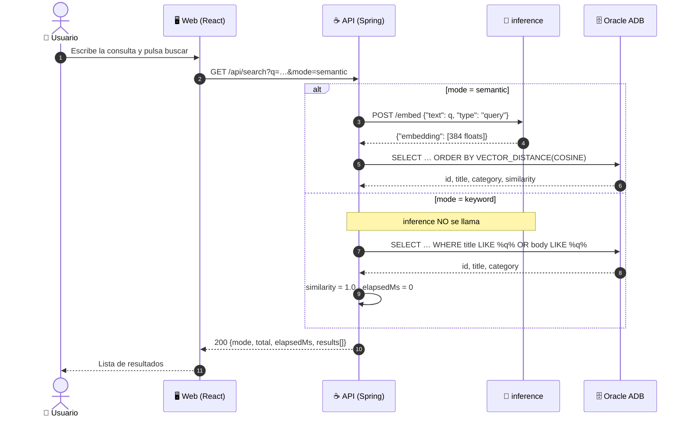
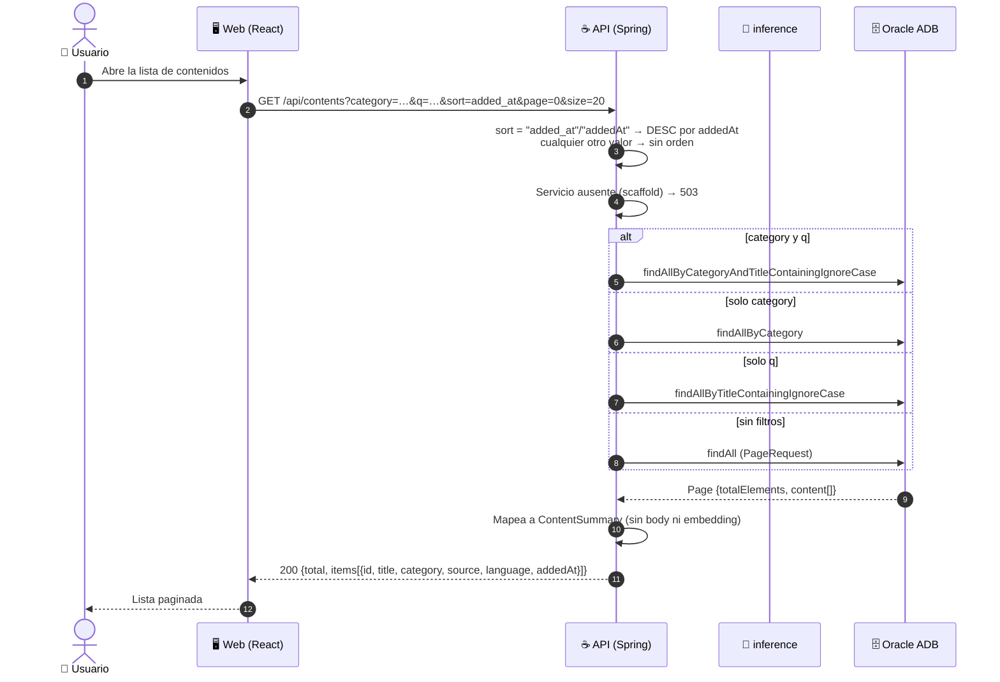
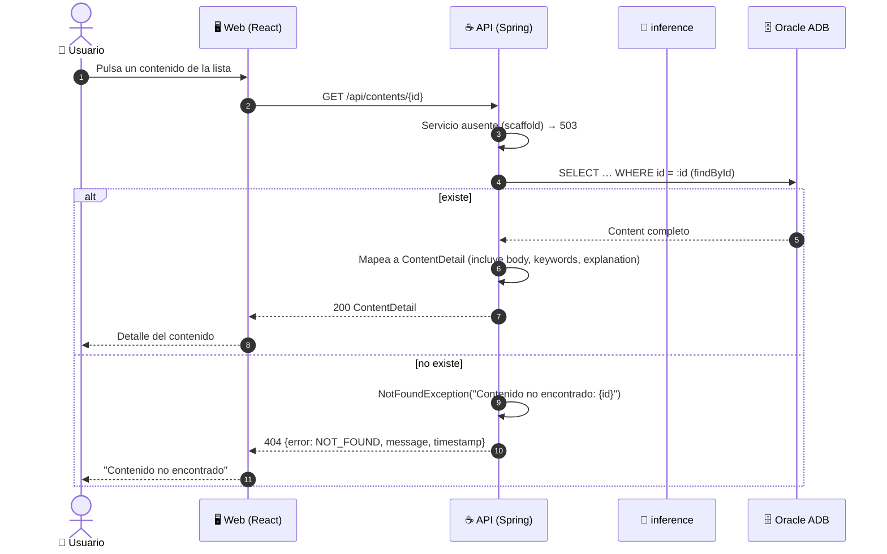
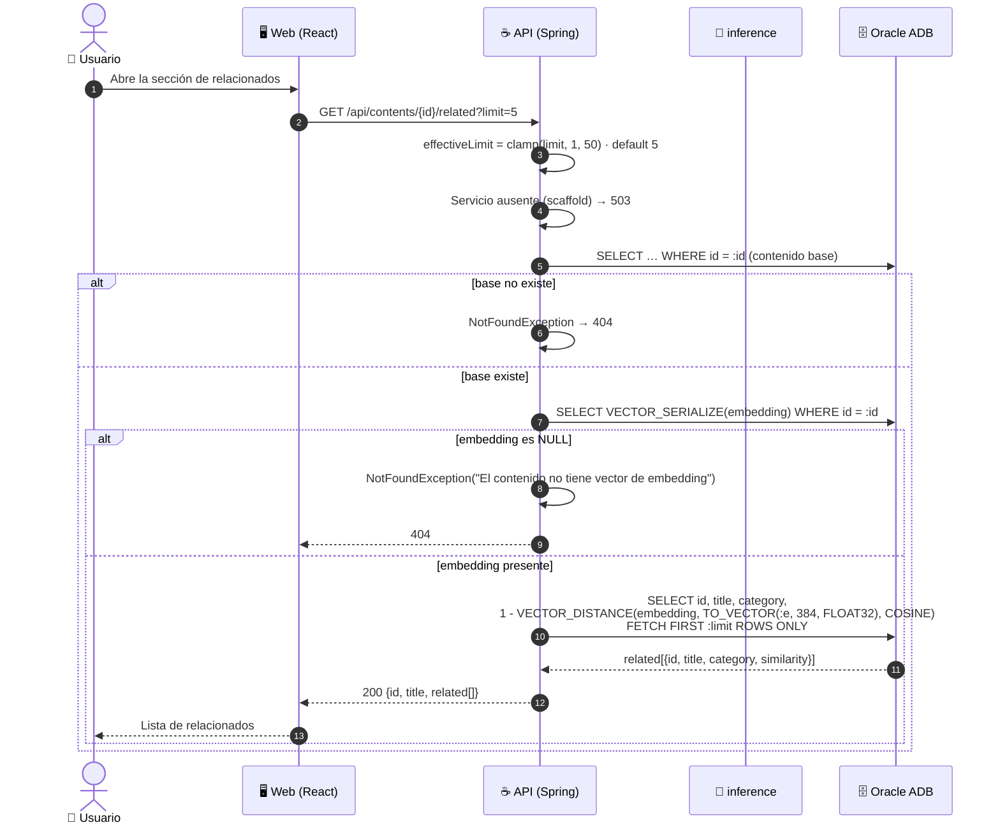
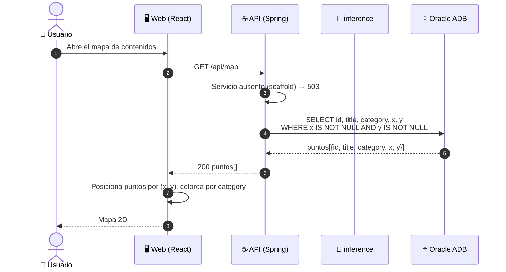
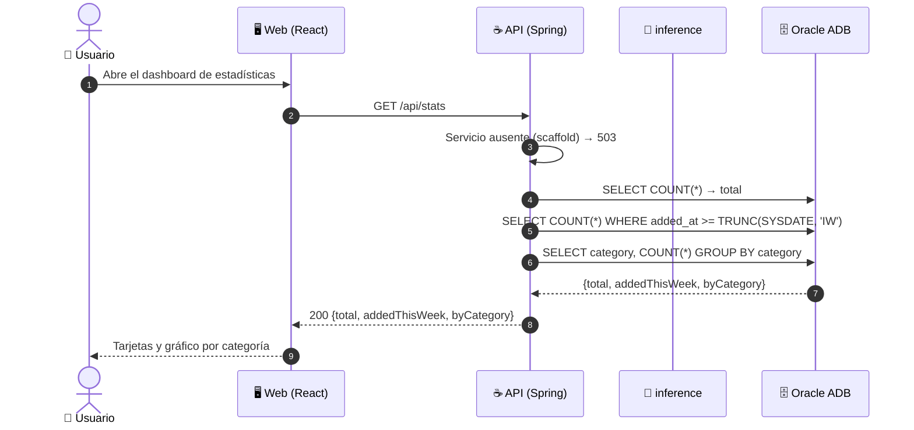
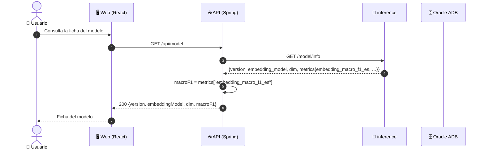
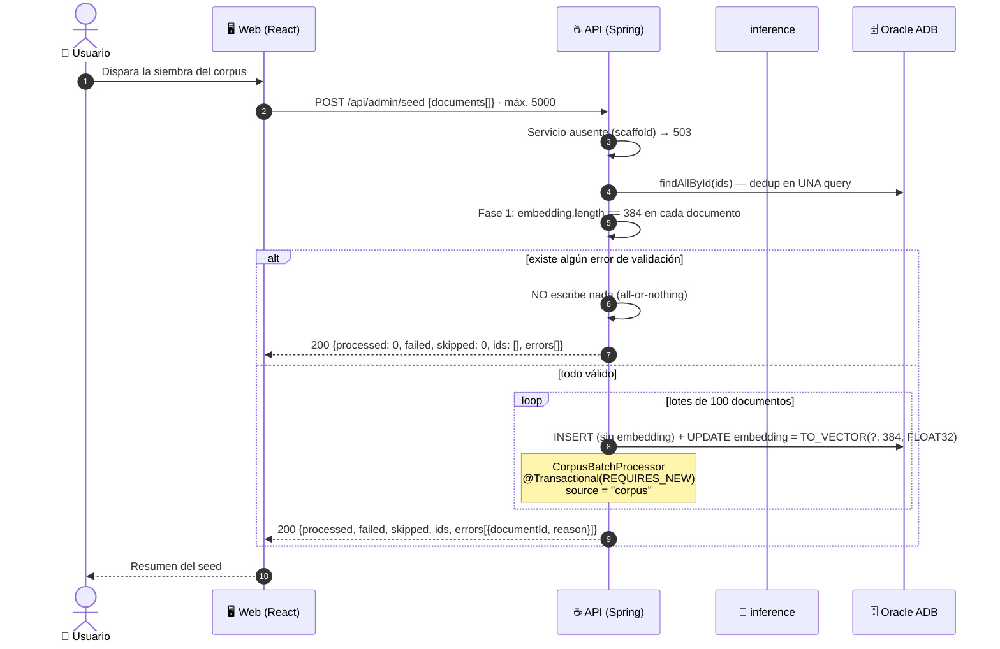
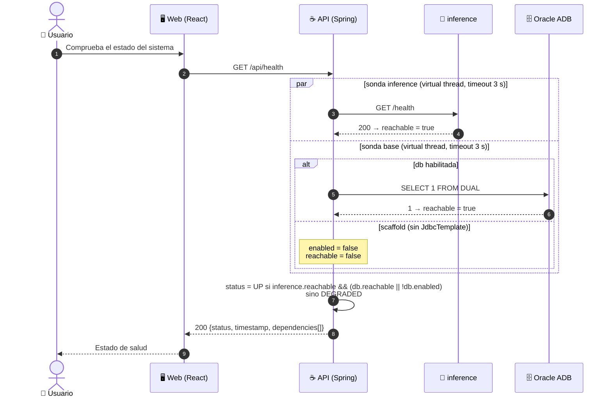

# Flujos por endpoint — Mindloom API

Diagramas de secuencia (`sequenceDiagram`) de cada endpoint de la API. Los tres
flujos centrales ya tienen documentación profunda en `docs/` (raíz) y aquí solo
llevan un resumen de tres líneas y enlace; el resto lleva diagrama completo.

Convención de actores, idéntica a `docs/01..06` de la raíz:

| Participante | Rol |
|---|---|
| 👤 Usuario | quien dispara la acción |
| 🖥️ Web (React) | la SPA; única capa que traduce claves a etiquetas ES |
| ☕ API (Spring) | esta aplicación (`techapi`) |
| 🐍 inference | FastAPI `:8000`; embebe y clasifica |
| 🗄️ Oracle ADB | la base externa; resuelve similitud con `VECTOR_DISTANCE` |

---

## 1. Endpoints ya documentados (resumen)

### `POST /content` — ingesta de un contenido

Documentación completa: [`../../docs/01-post-content.md`](../../docs/01-post-content.md)

1. Es el único flujo donde intervienen las cuatro capas: la Web envía
   `{title, body}`, la API llama **una vez** a `POST /predict` y escribe en la
   ADB tres veces (INSERT sin embedding, UPDATE con `TO_VECTOR`, SELECT de 5
   vecinos), todo dentro de una transacción.
2. El embedding se persiste aparte por `JdbcTemplate` porque la entidad
   `Content` **no tiene** campo `embedding` (JPA no mapea `VECTOR(384,FLOAT32)`).
3. Responde **201** con `{id: "usr-"+UUID, category, probability, keywords,
   related, explanation}`; los `related` salen gratis del vector recién insertado.

### `GET /search` — búsqueda semántica y por palabra clave

Documentación completa: [`../../docs/02-search-semantic.md`](../../docs/02-search-semantic.md)

1. `mode=semantic` (default) llama una vez a `POST /embed` con `type:"query"` y
   deja la comparación en la ADB (`VECTOR_DISTANCE`, COSINE); `mode=keyword` **no
   toca inference** y hace `LIKE` sobre `title`/`body`.
2. En `semantic`, `category` filtra por columna; en `keyword` se **concatena** al
   texto (`q + " " + category`), así que casi siempre devuelve cero resultados.
3. `similarity = 1 - VECTOR_DISTANCE(COSINE)` (1.0 = idéntico); en `keyword`
   `similarity=1.0` fija y `elapsedMs=0` — no hay ranking.

Diagrama compacto (la bifurcación real está en el `alt`):

### `POST /contents/batch` — carga masiva desde CSV

Documentación completa: [`../../docs/04-batch-csv.md`](../../docs/04-batch-csv.md)

1. Multipart con campo `file` (CSV `title,body`, máx. 5 MB): la API descarta la
   cabecera y parsea cada fila con `parseCsvLine` (aware de comillas).
2. Por cada fila válida llama `ContentIngestionServiceImpl.ingest` → **una**
   `POST /predict`: N filas = N llamadas a inference y 3 operaciones de base por
   fila dentro de una sola request HTTP.
3. Devuelve **200 siempre** (aunque haya filas malas):
   `{processed, failed, ids, errors[{row, reason}], byCategory}`; 400 solo si el
   archivo no es CSV, está vacío o supera 5 MB.

---

## 2. Diagramas completos

### `GET /contents` — lista paginada

Lista de contenidos con filtros opcionales. Solo toca la base; no llama a
inference.

> `total` es `Page.getTotalElements()` — a diferencia de `/search`, aquí **sí**
> sirve para paginar.

### `GET /contents/{id}` — detalle de un contenido

### `GET /contents/{id}/related` — contenidos relacionados

Vecinos por similitud de vector. Tres pasos a la base: el contenido base, su
embedding serializado y la búsqueda `VECTOR_DISTANCE`.

> La comparación corre **en la base**, no en la API: `inference` no participa.
> Un contenido sin vector (p. ej. una fila cuyo `UPDATE` de embedding falló)
> responde 404, no resultados vacíos.

### `GET /map` — puntos del mapa

### `GET /stats` — estadísticas

> `addedThisWeek` usa `TRUNC(SYSDATE, 'IW')` (inicio de la semana ISO en la base).
> Las categorías del `label_encoder` son 8: Backend, Frontend, Móvil, Datos e IA,
> DevOps y Cloud, Bases de datos, Seguridad, Fundamentos.

### `GET /model` — información del modelo

> **Única ruta que funciona en ambos perfiles**: `ModelServiceImpl` no lleva
> `@ConditionalOnProperty` y `ModelController` inyecta `IModelService` directo
> (sin `Optional`). Con `inference` caído responde 503
> `"Inference service unavailable"`.

### `POST /admin/seed` — siembra del corpus

Carga masiva de documentos ya resueltos (embedding incluido). No llama a
inference: el embedding llega en el JSON. Requiere perfil `db`.

> Fase 1 = *parse don't validate*: si un documento falla la pre-validación
> (embedding ≠ 384 o id duplicado), **no se escribe nada** y `processed=0`. En la
> fase 2, cada lote de 100 corre en su propia transacción `REQUIRES_NEW` (bean
> separado para que el proxy aplique la anotación).

### `GET /health` — estado de salud

> Las sondas corren en hilos virtuales con timeout de 3 s y **aislamiento por
> sonda**: una sonda que falla jamás tumba el endpoint. En scaffold, con
> `database.enabled=false` pero `inference` sano, `status` sigue siendo `UP`.
> Cada dependencia reporta `{name, enabled, reachable, latencyMs, message}`.

---

## 3. Transversal — logging y errores

Dos piezas de `common/` envuelven **todas** las rutas anteriores:

- **`RequestLoggingFilter`** (`OncePerRequestFilter`) registra cada request al
  entrar y al salir:
  `→ METHOD URI?qs from addr` y `← METHOD URI -> status (ms)`. No re-entra en
  dispatch de errores ni async para no duplicar pares de log por request.
- **`GlobalExceptionHandler`** (`@ControllerAdvice`) devuelve siempre el cuerpo
  `{error, message, timestamp}`:

  | Excepción | HTTP | `error` |
  |---|---|---|
  | `ValidationException` | 400 | `VALIDATION_ERROR` |
  | `NotFoundException` | 404 | `NOT_FOUND` |
  | `MethodArgumentNotValid` / `ConstraintViolation` | 400 | `VALIDATION_ERROR` |
  | `InferenceUnavailableException` | 503 | `INTERNAL_ERROR` |
  | `MaxUploadSizeExceeded` | 400 | `VALIDATION_ERROR` — "El archivo excede el tamaño máximo permitido" |
  | `InferenceException` | 500 | `INTERNAL_ERROR` |
  | `Exception` (genérica) | 500 | `INTERNAL_ERROR` — "Error interno del servidor" |
