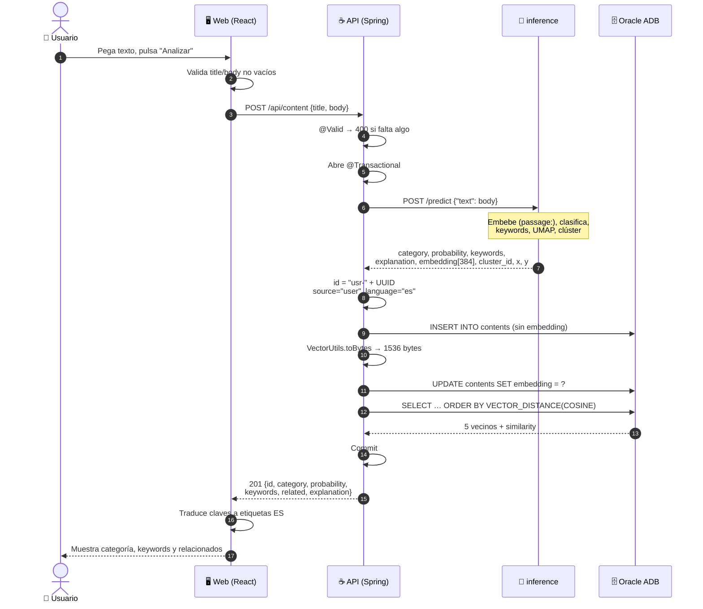

# `POST /content` — flujo completo

Panorama completo de **un** endpoint, con el payload exacto en cada salto. Es el
único flujo donde intervienen las cuatro capas, así que sirve de plantilla: los
demás endpoints son subconjuntos de este.

Contratos completos de todos los endpoints: `docs/CONTRATOS.md`.

---

## 1. Diagrama de secuencia

Flechas entre participantes sobre una línea de tiempo: muestra **el orden exacto
de las llamadas**.



Lo que el diagrama deja ver de un golpe:

- **`inference` es una hoja.** Nunca decide ni llama a nadie: entra texto, sale
  análisis. No conoce la base ni el `id`.
- **La base se toca tres veces**, no una: `INSERT`, `UPDATE` del embedding y
  `SELECT` vectorial — y las tres dentro de la misma transacción.
- **Una sola llamada a inference** para todo el análisis. La API no pide el
  embedding por separado.

---

## 2. Ejemplo: los payloads reales, salto por salto

### Salto 1 · Usuario → Web

Formulario con dos campos. El usuario no envía `id`, `category` ni nada más: **la
categoría es justo lo que viene a averiguar.**

### Salto 2 · Web → API

```http
POST /api/content HTTP/1.1
Content-Type: application/json
```
```json
{
  "title": "Índices vectoriales en Oracle",
  "body": "VECTOR_DISTANCE con COSINE compara embeddings normalizados sin recorrer la tabla completa."
}
```

Exactamente dos campos, `camelCase`. Cualquier campo extra se ignora en silencio.

### Salto 3 · API → inference

```http
POST http://inference:8000/predict
Content-Type: application/json
```
```json
{ "text": "VECTOR_DISTANCE con COSINE compara embeddings normalizados sin recorrer la tabla completa." }
```

Tres cosas que sorprenden y están así en el código:

- **Va solo el `body`**, el `title` no viaja a inference
  ([ContentIngestionServiceImpl.java:38](api/src/main/java/com/G9_LATAM_TEAM_58/techapi/inference/service/impl/ContentIngestionServiceImpl.java#L38)).
- El JSON aquí es **`snake_case`**, no `camelCase` como el público.
- Es **una sola llamada** para todo. La API no pide el embedding por separado.

### Salto 4 · inference → API

```json
{
  "category": "Bases de datos",
  "probability": 0.91,
  "keywords": ["oracle", "vector", "cosine"],
  "explanation": ["vector", "distance", "oracle"],
  "embedding": [0.021, -0.118, "… 384 floats, L2-normalizados, float32"],
  "cluster_id": 3,
  "x": 4.21,
  "y": -1.07
}
```

`category` viene **en español** — es uno de los 8 valores del `label_encoder`, y
es el único dato en español que cruza esta frontera. `explanation` son los
términos del baseline TF-IDF explicable, no las keywords.

### Salto 5 · API → base (dos escrituras, no una)

```sql
-- JPA. Nótese que embedding NO está en la lista.
INSERT INTO contents (id, title, body, category, probability, keywords,
                      explanation, cluster_id, x, y, source, language, added_at)
VALUES ('usr-9f3c1e0a-…', 'Índices vectoriales en Oracle', '…', 'Bases de datos',
        0.91, '["oracle","vector","cosine"]', '["vector","distance","oracle"]',
        3, 4.21, -1.07, 'user', 'es', TIMESTAMP '2026-07-28 10:32:41');

-- JdbcTemplate, con los 1536 bytes crudos.
UPDATE contents SET embedding = ? WHERE id = 'usr-9f3c1e0a-…';
```

**Son dos sentencias a propósito.** La entidad `Content` no tiene campo
`embedding`: JPA no mapea `VECTOR(384, FLOAT32)`, así que hay que pasarle los
bytes por JDBC. `keywords` y `explanation` sí las serializa JPA a JSON en `CLOB`
vía `StringListConverter`.

> ⚠️ **Si añades otra ruta de escritura y olvidas el `UPDATE`**, la fila queda sin
> vector y desaparece de toda búsqueda semántica y de todos los `related`. Sin
> error, sin log. Es el fallo silencioso más caro de este flujo.

### Salto 6 · API → base (lectura vectorial)

```sql
SELECT id, title, category,
       1 - VECTOR_DISTANCE(embedding, :v, COSINE) AS similarity
FROM contents
WHERE id <> 'usr-9f3c1e0a-…'
ORDER BY VECTOR_DISTANCE(embedding, :v, COSINE)
FETCH FIRST 5 ROWS ONLY;
```

**La búsqueda por similitud corre en la base, no en Python.** `inference` solo
embebe; nunca busca. Y como los vectores están L2-normalizados, coseno ≡ producto
punto: no re-normalizar en Java ni en el front.

Devuelve `List<Object[]>` — **el orden de las columnas del SELECT es el
contrato**, se lee por índice (`row[0]`…`row[3]`). Reordenar el SELECT rompe el
mapeo con un `ClassCastException` en runtime, no al compilar.

### Salto 7 · API → Web

```http
HTTP/1.1 201 Created
```
```json
{
  "id": "usr-9f3c1e0a-42b8-4d17-9a55-7c0e1b2d3f44",
  "category": "Bases de datos",
  "probability": 0.91,
  "keywords": ["oracle", "vector", "cosine"],
  "related": [
    { "id": "so-55190", "title": "Índices y planes de ejecución", "category": "Bases de datos", "similarity": 0.7311 },
    { "id": "so-78412", "title": "Cómo paginar con Spring Data JPA", "category": "Backend",      "similarity": 0.6890 }
  ],
  "explanation": ["vector", "distance", "oracle"]
}
```

Vuelve a `camelCase`. **No devuelve `title`, `body`, `embedding`, `clusterId`,
`x` ni `y`** — si el front los necesita, pide `GET /contents/{id}`.

Los `related` salen gratis: se calculan con el vector recién insertado, así que la
pantalla de resultado ya tiene con qué llenar la barra lateral sin una segunda
llamada.

### Salto 8 · Web → Usuario

React es **la única capa que traduce**: `probability: 0.91` → "91 % de confianza",
`similarity: 0.73` → "73 % de afinidad", la clave `keywords` → "Palabras clave".
La categoría `"Bases de datos"` **no se traduce**: ya viene en español.
