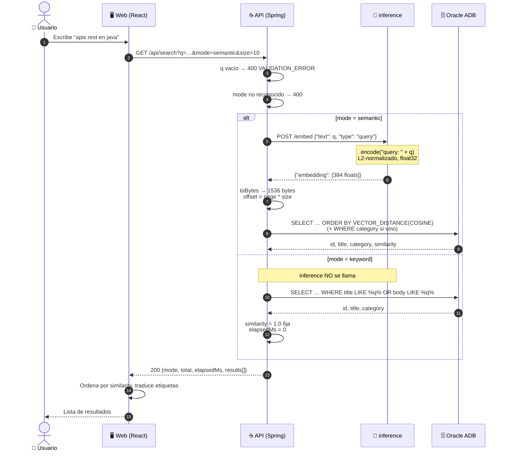

# `GET /search` — búsqueda semántica y por palabra clave

El flujo de **lectura** que define el producto: encontrar contenido por
*significado*, no por coincidencia de texto. Es el otro que toca las cuatro capas,
junto con `01-post-content.md`.

Contratos completos de todos los endpoints: `docs/CONTRATOS.md`.

---

## 1. Diagrama de secuencia

El `alt` es la bifurcación real: **`mode=keyword` no toca inference en absoluto.**



Lo que el diagrama deja ver de un golpe:

- **`inference` embebe, no busca.** Solo convierte la consulta en vector. La
  comparación la hace `VECTOR_DISTANCE` en Oracle. Quien venga de un stack con
  FAISS o Chroma espera lo contrario.
- **Una llamada a inference por búsqueda**, no una por resultado.
- **`keyword` es un camino degradado**, no un modo equivalente: sin vectores, sin
  ranking y sin métrica de tiempo.

---

## 2. Ejemplo: los payloads reales, salto por salto

### Salto 1 · Web → API

```http
GET /api/search?q=apis%20rest%20en%20java&mode=semantic&category=Backend&page=0&size=10
```

| Param | Default | Notas |
|---|---|---|
| `q` | **obligatorio** | vacío o en blanco → **400** `VALIDATION_ERROR` |
| `mode` | `semantic` | `semantic` \| `keyword`, case-insensitive. Otro valor → **400** |
| `category` | — | en `semantic` filtra por columna; en `keyword` **no** (ver salto 4) |
| `page` | `0` | base 0 |
| `size` | `10` | |

### Salto 2 · API → inference

```http
POST http://inference:8000/embed
```
```json
{ "text": "apis rest en java", "type": "query" }
```

> ⚠️ **`type` tiene que ser `"query"` aquí.** El modelo E5 prefija internamente
> `"query: "` a las consultas y `"passage: "` a los documentos. Mandar
> `"passage"` en una búsqueda **no da error**: devuelve resultados peores, en
> silencio. Es el fallo más caro del proyecto porque no deja rastro.

`type` es `Literal["query", "passage"]` en Pydantic: cualquier otro valor da
**422** en FastAPI, que la API traduce a **400** `VALIDATION_ERROR`.

### Salto 3 · inference → API

```json
{ "embedding": [0.021, -0.118, "… 384 floats, L2-normalizados, float32"] }
```

Solo el vector. `/embed` no clasifica ni extrae keywords — para eso está
`/predict`, que es el de la ingesta.

### Salto 4 · API → base

Con `VectorUtils.toBytes()` los 384 floats se vuelven 1536 bytes, y
`offset = page * size`:

```sql
-- sin category
SELECT id, title, category,
       1 - VECTOR_DISTANCE(embedding, :queryEmbedding, COSINE) AS similarity
FROM contents
ORDER BY VECTOR_DISTANCE(embedding, :queryEmbedding, COSINE)
OFFSET :offset ROWS FETCH NEXT :limit ROWS ONLY;

-- con category: mismo SELECT + WHERE category = :category
```

Dos queries distintas del repositorio, no una con filtro opcional:
`semanticSearch` y `semanticSearchWithCategory`
([ContentRepository.java](api/src/main/java/com/G9_LATAM_TEAM_58/techapi/domain/ContentRepository.java)).

**En `mode=keyword` el comportamiento cambia de forma importante:**

```sql
SELECT id, title, category FROM contents
WHERE title LIKE %:q% OR body LIKE %:q%
```

Y antes de ejecutarla, el servicio **concatena la categoría al texto buscado**:

```java
String query = q;
if (category != null && !category.isBlank()) {
    query = q + " " + category;      // NO es un filtro por columna
}
```

Es decir: `?q=spring&category=Backend&mode=keyword` busca literalmente
`"spring Backend"` dentro de `title`/`body`, lo que casi siempre devuelve **cero
resultados**. En `semantic` sí filtra por columna. Misma firma, semántica
distinta.

### Salto 5 · API → Web

```json
{
  "mode": "semantic",
  "total": 2,
  "elapsedMs": 143,
  "results": [
    { "id": "devto-4821", "title": "Introducción a Spring Boot",        "category": "Backend", "similarity": 0.8641 },
    { "id": "so-78412",   "title": "Cómo paginar con Spring Data JPA",  "category": "Backend", "similarity": 0.8117 }
  ]
}
```

`similarity` es `1 - VECTOR_DISTANCE(..., COSINE)`: **1.0 = idéntico**, ~0 = sin
relación. Ya viene ordenado descendente desde la base.

> ⚠️ **`total` es el tamaño de la página, no del resultado completo.** Sale de
> `results.size()`. Con `size=10` y 500 coincidencias, `total` vale `10`. **No
> sirve para pintar un paginador** con número de páginas. Si el front lo
> necesita, hay que cambiar el contrato — y eso se acuerda antes, no en un PR.

> ⚠️ **`elapsedMs` solo es real en `semantic`.** En `keyword` está hardcodeado a
> `0`, y `similarity` a `1.0` para todos los resultados: no hay ranking que
> mostrar.

### Salto 6 · Web → Usuario

React traduce `similarity: 0.86` → "86 % de afinidad". La `category` **no se
traduce**: ya viene en español desde la base.

---

## 3. Estado: por qué hoy todos los resultados empatan

`inference` **todavía no carga el modelo**
([inference/app/main.py](inference/app/main.py)): `/embed` devuelve siempre el
mismo vector mock `[0.021, -0.118, 0.0 × 382]`.

Como todos los embeddings guardados son idénticos, `VECTOR_DISTANCE` da lo mismo
para cualquier par y **el orden de los resultados es arbitrario**, con
`similarity` igual en todos. El contrato JSON es el definitivo; el ranking no
existe hasta que el modelo sea real.
