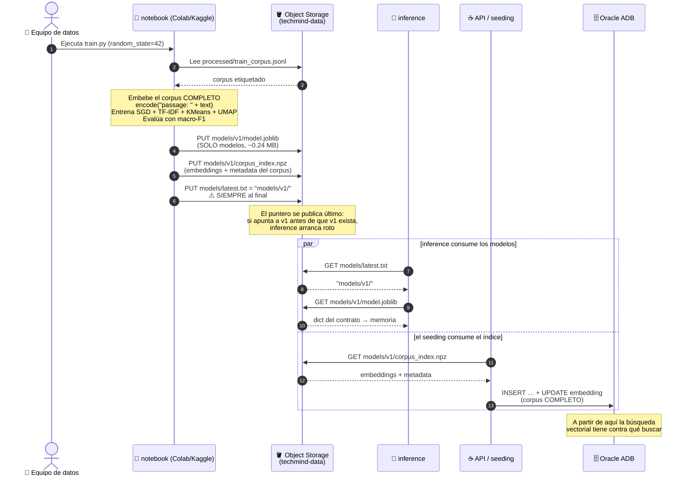

# `notebook/` → `model.joblib` + `corpus_index` → tabla `contents`

El único flujo que **no es una petición HTTP**, y el más caro de malentender: es la
frontera entre Data Science y Backend. Tres personas construyen contra ella.

Contrato de las claves del artefacto: `docs/TECHMIND.md`. Layout del bucket:
`docs/oci/02-object-storage.md`.

---

## 1. Diagrama de secuencia

Los carriles aquí son **personas y sistemas mezclados**, no capas de una request.



Lo que el diagrama deja ver de un golpe:

- **El artefacto se parte en dos y cada mitad va a un consumidor distinto.**
  `model.joblib` → `inference`. `corpus_index.npz` → la base. Nunca al revés.
- **`latest.txt` se sube último, siempre.** Es la única ordenación obligatoria de
  todo el flujo.
- **`inference` y el seeding son independientes**: por eso van en `par`. Uno puede
  estar listo sin el otro, y ahí está el fallo silencioso de abajo.

---

## 2. El reparto: qué va en cada archivo

| Archivo | Qué lleva | Quién lo consume | Tamaño |
|---|---|---|---|
| `models/v1/model.joblib` | **solo modelos**: clasificador, encoders, vectorizers, kmeans, umap | `inference` en *startup* | ~0.24 MB |
| `models/v1/corpus_index.npz` | **embeddings + metadata** del corpus | el **seeding**, que llena `contents` | MB |
| `models/latest.txt` | puntero de texto: `models/v1/` | `inference`, para saber qué versión bajar | bytes |

### Las claves del `model.joblib`

```python
{
  "meta": {"version", "embedding_model", "dim", "categories", "metrics", ...},
  "classifier":          SGDClassifier,       # embeddings -> categoría; partial_fit
  "label_encoder":       LabelEncoder,
  "keyword_vectorizer":  TfidfVectorizer,     # keywords (bilingüe)
  "baseline_vectorizer": TfidfVectorizer,     # baseline explicable
  "baseline_classifier": LogisticRegression,  # baseline explicable
  "kmeans":              KMeans,              # clúster de contenido NUEVO
  "umap_reducer":        UMAP,                # proyección 2D de contenido NUEVO
}
```

`kmeans` y `umap_reducer` van como **modelos ajustados, no como arrays
precalculados**, precisamente para que `inference` pueda clusterizar y proyectar
documentos **nuevos** en tiempo de request. Si se exportaran los arrays, la
ingesta no podría asignar `cluster_id`, `x` ni `y` a un contenido que el notebook
nunca vio.

> ⚠️ **Las embeddings del corpus NO van en el joblib.** Es el malentendido número
> uno. El joblib solo lleva modelos; los vectores del corpus van en el
> `corpus_index` y terminan en la columna `embedding` de la tabla. Meterlos en el
> joblib lo infla a cientos de MB y no sirve de nada: la búsqueda ocurre en la
> base, no en Python.

> ⚠️ **El transformer E5 tampoco va en el joblib** (serían ~470 MB). Solo viaja su
> **nombre**, en `meta["embedding_model"]`. Ver `05-arranque-inference.md`.

---

## 3. Ejemplo: la publicación, comando por comando

### Paso 1 · Entrenar y exportar

```python
# notebook/train.py
vec = encoder.encode(["passage: " + t for t in texts],   # prefijo de DOCUMENTO
                     normalize_embeddings=True)          # L2, float32

# ... entrenar con random_state=42 en cada split y modelo ...

joblib.dump({
    "meta": {"version": "v1", "embedding_model": "intfloat/multilingual-e5-small",
             "dim": 384, "categories": CATEGORIES,
             "metrics": {"embedding_macro_f1_es": 0.87, "tfidf_macro_f1_es": 0.79}},
    "classifier": sgd, "label_encoder": le,
    "keyword_vectorizer": kw_vec, "baseline_vectorizer": bl_vec,
    "baseline_classifier": bl_clf, "kmeans": km, "umap_reducer": umap,
}, "model.joblib")

np.savez_compressed("corpus_index.npz",
                    ids=ids, titles=titles, categories=cats,
                    embeddings=vec, x=xy[:, 0], y=xy[:, 1], clusters=clusters)
```

Tres reglas que se rompen a menudo:

- **`"passage: "` en el corpus, `"query: "` en las consultas.** Si el notebook
  embebe sin prefijo y `inference` sí lo pone (o al revés), la similitud se
  degrada sin lanzar ningún error.
- **El índice cubre el corpus COMPLETO**, no solo el split de entrenamiento.
  Indexar solo `train` esconde el 20 % de los documentos de toda recomendación,
  para siempre y sin aviso.
- **`random_state=42`** en cada split, modelo y llamada a UMAP. Sin eso, dos
  personas obtienen métricas distintas del mismo código.

### Paso 2 · Subir, en este orden

```bash
oci os object put --bucket-name techmind-data \
  --file model.joblib --name models/v1/model.joblib

oci os object put --bucket-name techmind-data \
  --file corpus_index.npz --name models/v1/corpus_index.npz

# EL PUNTERO, AL FINAL
echo "models/v1/" > latest.txt
oci os object put --bucket-name techmind-data \
  --file latest.txt --name models/latest.txt
```

> ⚠️ **Si `latest.txt` apunta a `v2` antes de que `v2/model.joblib` exista**,
> cualquier reinicio de `inference` falla al arrancar: baja el puntero, pide un
> objeto que no está y muere en el startup. El healthcheck nunca pasa a *healthy*
> y la API no arranca (`depends_on: service_healthy`). Es una caída completa del
> stack por un orden de subida.

### Paso 3 · El seeding llena la tabla

```
corpus_index.npz          →          tabla contents
──────────────────                   ──────────────
ids[i]                    →          id
titles[i]                 →          title
categories[i]             →          category
embeddings[i] (384 f32)   →          embedding  VECTOR(384, FLOAT32)  ← vía bytes
x[i], y[i]                →          x, y
clusters[i]               →          cluster_id
```

Las claves del `corpus_index` van **en inglés**, alineadas con las columnas de
`contents` — la misma clave viaja en el `.jsonl`, en el `npz` y en la columna.

> 🚧 **El seeding es la pieza que aún no existe.** Sin él, la tabla arranca vacía y
> **la búsqueda semántica no devuelve nada aunque el modelo esté perfecto** — el
> síntoma es `results: []` con `total: 0`, sin ningún error. Candidatos: reutilizar
> el `BatchUploadController` que ya existe, o un script one-time. Hoy no está
> asignado a nadie.

---

## 4. Cómo saber si el flujo funcionó

```bash
# 1. inference tiene el modelo cargado y reporta métricas reales (no 0.0)
curl http://localhost:8080/model
# → {"version":"v1","embeddingModel":"intfloat/multilingual-e5-small","dim":384,"macroF1":0.87}

# 2. la tabla está sembrada
curl http://localhost:8080/stats
# → total > 0 y byCategory con las 8 categorías

# 3. la búsqueda semántica devuelve algo ordenado
curl "http://localhost:8080/search?q=apis+rest+en+java&mode=semantic&size=5"
# → similarity DISTINTAS y descendentes
```

Si el paso 3 devuelve `similarity` idénticas en todos los resultados, el modelo
sigue siendo el mock. Si devuelve lista vacía con `total: 0`, falta el **seeding**.

---

## 5. Regla de oro

**No añadas ni renombres una clave del `model.joblib` sin actualizar
`docs/TECHMIND.md` y avisar al equipo.** `inference` la lee por nombre: una clave
renombrada es un `KeyError` en el startup, y el startup fallido tumba también a la
API. Tres personas construyen contra este contrato.
