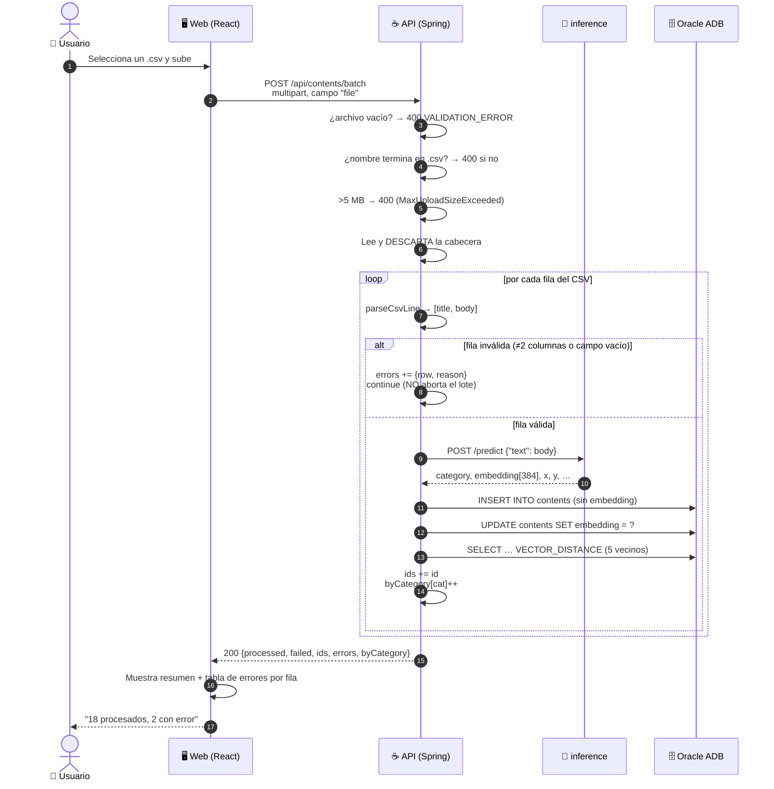

# `POST /contents/batch` — carga masiva desde CSV

Mismo flujo que `01-post-content.md`, pero **en bucle**. Lo interesante no es el
paso, es la repetición: una llamada a inference **por fila**.

Contratos completos de todos los endpoints: `docs/CONTRATOS.md`.

---

## 1. Diagrama de secuencia

El bloque `loop` es todo el punto de este diagrama.



Lo que el diagrama deja ver de un golpe:

- **Un CSV de 500 filas son 500 llamadas a inference** dentro de una sola request
  HTTP. Con 30 s de `read-timeout` por llamada, el peor caso es una eternidad.
- **Cada fila hace 3 operaciones a la base**, no una: `INSERT`, `UPDATE` del
  embedding y `SELECT` vectorial. 500 filas = 1500 operaciones.
- **Una fila que falla no aborta el lote**: el `continue` acumula el error y sigue.
- **El `SELECT` de vecinos se ejecuta por fila y se descarta.** El
  `BatchUploadResponse` no lleva `related` — se calcula y se tira.

---

## 2. Ejemplo: el CSV y la respuesta

### Salto 1 · Web → API

```http
POST /api/contents/batch HTTP/1.1
Content-Type: multipart/form-data; boundary=----X
```

Un solo campo, obligatoriamente llamado **`file`**
([BatchUploadController.java](api/src/main/java/com/G9_LATAM_TEAM_58/techapi/inference/controller/BatchUploadController.java)).

Validaciones en el controlador, **antes** de tocar cualquier servicio:

| Condición | Respuesta |
|---|---|
| archivo vacío | **400** `VALIDATION_ERROR` — "El archivo no puede estar vacío" |
| nombre no termina en `.csv` | **400** `VALIDATION_ERROR` — "El archivo debe ser un CSV" |
| > 5 MB (o request > 10 MB) | **400** `VALIDATION_ERROR` — "El archivo excede el tamaño máximo permitido" |
| BD no configurada | **503** `INTERNAL_ERROR` |

El chequeo del `.csv` es **solo por extensión**, no por contenido: un `.csv` que
en realidad es un Excel pasa el filtro y falla fila por fila.

### Salto 2 · El formato del archivo

```csv
title,body
"Índices vectoriales","Un índice HNSW aproxima, con error acotado, el vecino más cercano"
"React y Suspense","Suspense permite declarar estados de carga"
,"Cuerpo sin título"
```

- **La primera línea se descarta siempre**, sea o no una cabecera real. Si tu CSV
  no tiene cabecera, pierdes el primer contenido en silencio.
- **Dos columnas: `title,body`.** Nada más. `category`, `source` y `url` no se
  pueden cargar por aquí: la categoría la predice el modelo, `source` se fija a
  `"user"` y `language` a `"es"`, igual que en el alta individual.
- Hay soporte de **comillas dobles** para comas internas (parser propio,
  `parseCsvLine`). No hay soporte para **saltos de línea dentro de un campo**: un
  `body` multilínea entre comillas se parte y genera filas inválidas.

La numeración de `row` en los errores empieza en **1 después de la cabecera**: la
línea 2 del archivo es `row: 1`.

### Salto 3 · Por cada fila, el flujo completo del alta

Internamente llama a `IContentIngestionService.ingest()`, el **mismo servicio** que
`POST /content`:

```java
ContentIngestionResponse result = contentIngestionService.ingest(request);
ids.add(result.getId());
byCategory.merge(result.getCategory(), 1L, Long::sum);
```

Eso significa que cada fila hace exactamente lo de `01-post-content.md`: predict →
`INSERT` → `UPDATE` del embedding → `SELECT` de 5 vecinos.

> ⚠️ **La transacción es por fila, no por lote.** `ingest()` lleva
> `@Transactional`; el bucle que lo llama, no. Si la fila 300 revienta, **las 299
> anteriores quedan guardadas**. No hay forma de deshacer un lote a medias: hay
> que borrar por los `ids` que devolvió la respuesta.

### Salto 4 · API → Web

```json
{
  "processed": 2,
  "failed": 1,
  "ids": [
    "usr-9f3c1e0a-42b8-4d17-9a55-7c0e1b2d3f44",
    "usr-1a2b3c4d-5e6f-4071-8293-a4b5c6d7e8f9"
  ],
  "errors": [
    { "row": 3, "reason": "Título y cuerpo no pueden estar vacíos" }
  ],
  "byCategory": { "Bases de datos": 1, "Frontend": 1 }
}
```

> ⚠️ **Devuelve 200 incluso con errores**, y también con `processed: 0`. El front
> **no puede usar el status HTTP** para saber si fue bien: tiene que mirar
> `failed` y `errors`. Un CSV entero rechazado y un CSV entero correcto llegan con
> el mismo código.

`processed` es `ids.size()` y `failed` es `errors.size()`. Un error de lectura del
archivo también entra en `errors`, con `row = <última fila> + 1` y el motivo
`"Error de lectura: …"`.

### Salto 5 · Web → Usuario

Con `errors` el front puede pintar una tabla de "fila → motivo", que es lo único
que permite al usuario arreglar su CSV. Los `reason` ya vienen **en español**.

---

## 3. Recomendaciones para el front

- **No subas archivos grandes sin avisar al usuario.** No hay barra de progreso
  posible: la request es única y solo responde al terminar. Con 200 filas puede
  tardar minutos cuando el modelo sea real.
- **Sugiere lotes de ~50 filas.** El límite duro es 5 MB, pero el cuello de
  botella es el tiempo, no el tamaño.
- **Guarda los `ids` que devuelve.** Es la única forma de deshacer una carga
  equivocada, porque no hay rollback de lote.

---

## 4. Estado

Igual que el alta individual: mientras `inference` sea el mock, **todas las filas
se clasifican como `Backend` con `probability: 0.89`**, así que `byCategory`
siempre tendrá una sola clave. El contrato es el definitivo; la clasificación no.
