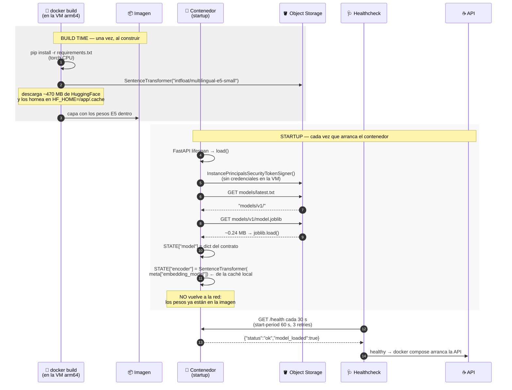

# Arranque de `inference` — build time vs startup

No es una petición: es **ciclo de vida**. El servicio carga dos piezas de origen y
momento distintos, y confundirlas es lo que rompe el arranque.

> 🚧 **Esto está pendiente de implementar.** El `TODO` vive en
> [inference/Dockerfile](inference/Dockerfile) y hoy `main.py` responde mocks. Este
> documento es **especificación**, no descripción: sirve para construirlo.

---

## 1. Diagrama de secuencia

Fíjate en dónde cae la línea que separa *build* de *runtime*.



Lo que el diagrama deja ver de un golpe:

- **Dos descargas, dos momentos.** El transformer (~470 MB) se baja **una vez, en
  build**. El `model.joblib` (~0.24 MB) se baja **en cada startup**.
- **`load()` corre una sola vez.** Después todo vive en memoria: ninguna request
  vuelve al bucket.
- **El healthcheck es la puerta de la API.** Si `load()` falla, `/health` nunca
  responde, el contenedor no llega a *healthy* y `docker compose` **no arranca la
  API** (`depends_on: condition: service_healthy`). Un modelo roto tumba el stack
  completo, no solo inference.

---

## 2. Por qué el transformer va en la imagen y el joblib no

| | Transformer E5 | `model.joblib` |
|---|---|---|
| Tamaño | ~470 MB | ~0.24 MB |
| Cambia | casi nunca | en cada reentrenamiento |
| Cuándo se obtiene | **build time** | **startup** |
| Dónde queda | capa de la imagen (`HF_HOME`) | memoria del proceso |
| Cómo se autentica | red pública (HuggingFace) | **Instance Principal** |

La regla detrás: **lo que no cambia se hornea; lo que cambia se baja.** Si el
transformer se bajara en startup, cada reinicio costaría 470 MB de red y el
contenedor no podría arrancar sin internet. Si el joblib se horneara, cada
reentrenamiento exigiría reconstruir y redeployar la imagen.

> ⚠️ **El transformer NO está dentro del `model.joblib`.** Solo viaja su nombre, en
> `meta["embedding_model"]`. Es lo que permite que el joblib pese KB en vez de
> cientos de MB. Ver `03-modelo-a-base.md`.

---

## 3. Ejemplo: el código, pieza por pieza

### Build time — el `Dockerfile`

```dockerfile
ENV HF_HOME=/app/.cache/huggingface

COPY requirements.txt .
RUN pip install --no-cache-dir -r requirements.txt

# Hornear el transformer para que el contenedor arranque offline:
RUN python -c "from sentence_transformers import SentenceTransformer; \
    SentenceTransformer('intfloat/multilingual-e5-small')"
```

`HF_HOME` tiene que estar declarado **antes** del `RUN` que descarga, o los pesos
caen en el home por defecto y la capa horneada no se encuentra en runtime.

> ⚠️ **Torch tiene que ser la wheel de CPU:**
> `pip install torch --index-url https://download.pytorch.org/whl/cpu`. El índice
> por defecto arrastra 2 GB de CUDA sin usar e infla la imagen 4×. **No hay GPU en
> producción.**
>
> Matiz que ya está anotado en el Dockerfile: en `aarch64` **no existen wheels de
> CUDA**, así que el índice por defecto ya resuelve a CPU. La regla del
> `--index-url` importa al construir en **x86** — dev local y runners de GitHub —,
> no en la VM.

### Startup — el `load()`

```python
# inference/app/model.py  (a implementar)
import io, os, joblib, oci
from sentence_transformers import SentenceTransformer

STATE = {}

def _bucket_client():
    try:                                   # en la VM: sin credenciales
        signer = oci.auth.signers.InstancePrincipalsSecurityTokenSigner()
        return oci.object_storage.ObjectStorageClient({}, signer=signer)
    except Exception:                      # en local: ~/.oci/config (API key)
        return oci.object_storage.ObjectStorageClient(oci.config.from_file())

def load():
    client = _bucket_client()
    ns = client.get_namespace().data
    bucket = os.environ["MODEL_BUCKET"]                  # techmind-data

    prefix = client.get_object(ns, bucket, "models/latest.txt").data.content.decode().strip()
    blob   = client.get_object(ns, bucket, prefix + "model.joblib").data.content
    model  = joblib.load(io.BytesIO(blob))               # dict del contrato

    STATE["model"] = model
    STATE["encoder"] = SentenceTransformer(model["meta"]["embedding_model"])  # de la caché
```

Se llama una vez, desde el `lifespan` de FastAPI. **Dos peticiones al bucket, no
una**: primero el puntero, después el objeto al que apunta. Esa indirección es lo
que permite cambiar de versión sin redeployar.

El `try/except` del cliente es lo que hace que el mismo código corra en la VM (sin
credenciales, con Instance Principal) y en local (con `~/.oci/config`).

### Runtime — de dónde sale cada campo de `/predict`

```python
def predict(text: str):
    m = STATE["model"]; enc = STATE["encoder"]
    vec = enc.encode("passage: " + text, normalize_embeddings=True)   # prefijo de DOCUMENTO
    cat = m["label_encoder"].inverse_transform(m["classifier"].predict([vec]))[0]
    prob = m["classifier"].predict_proba([vec]).max()
    keywords = _top_terms(m["keyword_vectorizer"], text)
    cluster = int(m["kmeans"].predict([vec])[0])          # clúster de contenido NUEVO
    x, y = m["umap_reducer"].transform([vec])[0]          # proyección de contenido NUEVO
    ...

def embed(text: str, type: str):     # type = "query" | "passage"
    vec = STATE["encoder"].encode(f"{type}: " + text, normalize_embeddings=True)
    return {"embedding": vec.tolist()}
```

`normalize_embeddings=True` no es opcional: la base compara con
`VECTOR_DISTANCE(..., COSINE)` asumiendo vectores L2-normalizados.

### El healthcheck

```dockerfile
HEALTHCHECK --interval=30s --timeout=5s --start-period=60s --retries=3 \
  CMD python -c "import urllib.request,sys; sys.exit(0 if urllib.request.urlopen('http://localhost:8000/health').status==200 else 1)"
```

Usa `urllib` porque la imagen `slim` no trae `curl`. El `start-period` de 60 s le
da margen a `load()`; si el joblib crece o el bucket va lento, **ese número hay que
subirlo** o el contenedor entrará en bucle de reinicios.

Y `/health` debería reflejar el estado real:

```python
{"status": "ok", "model_loaded": "model" in STATE, "version": STATE["model"]["meta"]["version"]}
```

Hoy `model_loaded` está hardcodeado a `True`, lo que hace el healthcheck inútil:
pasa aunque no haya modelo.

---

## 4. Qué hace falta para implementarlo

1. Añadir a `inference/requirements.txt`: `sentence-transformers`, `torch` (CPU),
   `oci`, `joblib`, `scikit-learn`, `umap-learn`.
2. Descomentar el horneado del E5 en el `Dockerfile`.
3. Crear `app/model.py` con `load()`, `predict()` y `embed()` reales.
4. Enganchar `load()` al `lifespan` de FastAPI en `app/main.py`.
5. Hacer que `/health` y `/model/info` lean de `STATE`, no de constantes.
6. Que exista `models/latest.txt` en el bucket apuntando a una versión real
   (`03-modelo-a-base.md`).

**El paso 6 es un prerrequisito, no un detalle:** sin él, `load()` lanza y el
contenedor no arranca.

---

## 5. Síntomas y causas

| Síntoma | Causa probable |
|---|---|
| El contenedor reinicia en bucle | `load()` lanza: falta `latest.txt`, o apunta a una versión que no existe |
| `unhealthy` tras 60 s y la API no arranca | `load()` tarda más que el `start-period` — súbelo |
| `KeyError` en el startup | alguien renombró una clave del joblib sin avisar |
| Arranca pero las búsquedas son malas y no hay error | prefijos E5 mezclados (`passage` vs `query`) |
| La imagen pesa 4× lo esperado | torch se instaló desde el índice por defecto en x86 (CUDA) |
| `exec format error` al arrancar | imagen x86 en la VM Ampere — ver `06-deploy.md` |
