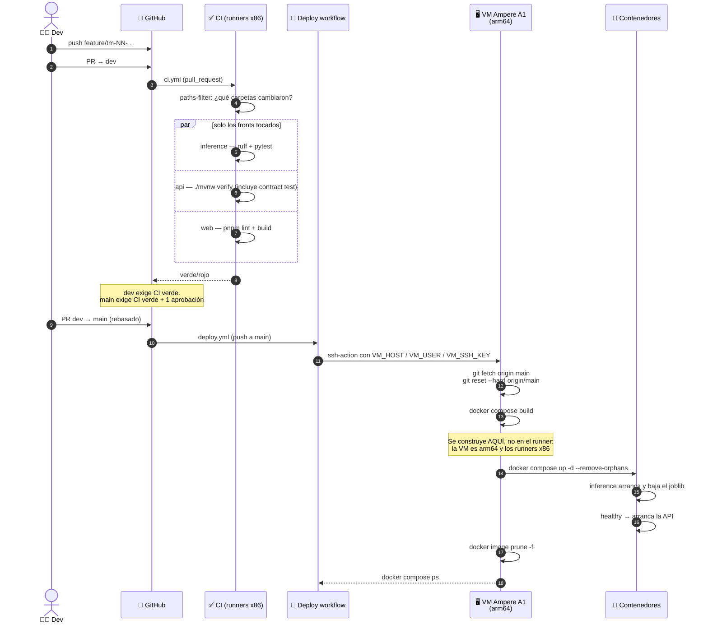

# De un PR a producción — CI y deploy

Cómo llega el código de una rama a la VM. Dos workflows distintos con disparadores
distintos: `ci.yml` valida, `deploy.yml` publica.

Runbook completo de la infraestructura: `docs/oci/`. Aquí solo va el flujo.

---

## 1. Diagrama de secuencia



Lo que el diagrama deja ver de un golpe:

- **La build ocurre en la VM, no en el runner.** Es la decisión de diseño central
  de este flujo, y la razón está en §3.
- **CI corre por carpeta, no siempre entero.** Un cambio en `docs/` no dispara
  ningún job.
- **El deploy no construye la web.** Va detrás de `profiles: [web]` en compose.
- **`git reset --hard origin/main`**: la VM no acumula estado del repo. Lo que esté
  modificado a mano allí **se pierde en cada deploy**.

---

## 2. Ejemplo: los dos workflows, disparador por disparador

### `ci.yml` — validar

```yaml
on:
  pull_request:
    branches: [dev, main]
  push:
    branches: [dev]
```

Primero un job `changes` con `dorny/paths-filter` decide qué corre:

```yaml
filters: |
  inference:
    - 'inference/app/**'
    - 'inference/tests/**'
    - 'inference/requirements.txt'
  api:
    - 'api/pom.xml'
    - 'api/src/**'
  web:
    - 'web/package.json'
    - 'web/src/**'
    - 'web/vite.config.*'
```

Los filtros apuntan al **manifiesto o el código real, no a la carpeta entera**.
Por eso `web/`, que hoy es solo un README y un `nginx.conf`, nunca dispara su job:
se queda *skipped* en verde. Cuando aparezca `web/package.json`, empieza a
validarse de verdad sin tocar el workflow.

| Job | Qué corre |
|---|---|
| `inference` | `pip install torch --index-url .../whl/cpu`, `requirements.txt`, `requirements-dev.txt`, `ruff check .`, `pytest -q` |
| `api` | `./mvnw -q -B verify` — incluye el **contract test**: mockea el servicio Python y afirma la forma del JSON acordada |
| `web` | `pnpm install --frozen-lockfile`, `pnpm run lint`, `pnpm run build` |

El **contract test del job `api`** es la red que protege la frontera de
`02-search-semantic.md` y `01-post-content.md`: si alguien cambia
`PredictResponse` sin avisar, salta ahí y no en producción.

### `deploy.yml` — publicar

```yaml
on:
  push:
    branches: [main]
  workflow_dispatch:

concurrency:
  group: deploy-vm
  cancel-in-progress: false
```

`concurrency` con `cancel-in-progress: false` importa: dos merges seguidos a `main`
**no** se pisan. El segundo espera a que el primero termine, en vez de dejar la VM
a medio construir.

El job entero es un `ssh-action` con este script:

```bash
set -euo pipefail
cd ~/techmind
git fetch origin main
git reset --hard origin/main
docker compose build
docker compose up -d --remove-orphans
docker image prune -f
docker compose ps
```

`set -euo pipefail` es lo que hace que el workflow falle si un paso falla —
`ssh-action@v1` no tiene input `script_stop`.

---

## 3. Por qué se construye en la VM

> ⚠️ **La VM es Ampere A1: `linux/arm64`. Los runners de GitHub son x86.** Una
> imagen x86 en esa VM falla con `exec format error` — no arranca, no hay
> diagnóstico útil.

Hay dos formas de resolverlo, y el proyecto eligió la segunda:

| | Cross-build en el runner | Build en la VM |
|---|---|---|
| Cómo | `docker buildx` + QEMU para `linux/arm64` | `ssh` + `docker compose build` |
| Coste | **20–40 min** una vez horneado el transformer (emulación) | nativo, minutos |
| Registry | hace falta uno intermedio | ninguno |
| Contra | lentísimo | la VM necesita el código y hace el trabajo |

Si alguna vez se mueve la build al runner, **`platform: linux/arm64` no es
opcional**.

---

## 4. Lo que vive solo en la VM y nunca en el repo

El deploy hace `git reset --hard`, así que todo lo que el repo no lleva tiene que
estar ya en la máquina y **sobrevivir** al reset (está fuera del árbol de git):

| Qué | Dónde | Cómo llega |
|---|---|---|
| `.env` | `~/techmind/.env` | copiado a mano desde `.env.example` |
| Wallet de la ADB | `~/techmind/wallet/` | descargado de OCI y descomprimido a mano |
| `model.joblib` | no está en la VM | lo baja `inference` del bucket en cada arranque |

```bash
# .env en la VM
SPRING_DATASOURCE_URL=jdbc:oracle:thin:@techmind_tp?TNS_ADMIN=/app/wallet
SPRING_DATASOURCE_USERNAME=ADMIN
SPRING_DATASOURCE_PASSWORD=…
OCI_NAMESPACE=…
MODEL_BUCKET=techmind-data
```

El wallet se monta de solo lectura (`./wallet:/app/wallet:ro`) y el
`TNS_ADMIN=/app/wallet` permite que el alias TNS (`techmind_tp`) baste como URL.

**Nunca se commitean:** `.env`, el wallet, los `.joblib` ni los datasets.

Secretos que necesita el workflow, en la configuración del repo: `VM_HOST`,
`VM_USER`, `VM_SSH_KEY`. No hay secretos de OCI CLI — la VM se autentica con
**Instance Principal**.

---

## 5. Puertos y quién alcanza a quién

```yaml
inference:
  expose: ["8000"]        # NO publicado: solo la api, por la red interna
api:
  ports: ["8080:8080"]    # publicado temporalmente, mientras no hay front
web:
  ports: ["80:80"]        # detrás de profiles: [web]
  profiles: [web]
```

- **`inference` no es alcanzable desde fuera.** `expose` abre el puerto solo en la
  red de compose. El puerto 8000 sigue cerrado en la Security List.
- **`8080` está publicado a propósito**, para que el equipo pueda pegarle a la API
  mientras se construye el front. Cuando todo pase por nginx (`/api`), puede bajar
  a `expose` y cerrarse.
- **La web no se sirve desde un bucket.** OCI Object Storage no puede hostear una
  SPA (sin fallback a `index.html`, un refresh en `/buscar` da 404), así que nginx
  la sirve desde la VM y hace de reverse proxy a la API. Un solo origen ⇒ sin CORS
  en producción.

---

## 6. Cuando el front esté listo

Tres cambios coordinados, no uno:

1. `deploy.yml`: `docker compose --profile web build` y
   `--profile web up -d`.
2. `docker-compose.yml`: quitar `profiles: [web]` del servicio.
3. `web/pnpm-lock.yaml` y `web/package.json` tienen que existir, o el job `web` de
   CI falla en el `--frozen-lockfile`.

---

## 7. Reglas de la rama

```
feature/tm-NN-short-description ──PR──> dev ──PR──> main
```

- **Nunca push directo a `main`.** Un push a `main` dispara deploy inmediato.
- Todo PR necesita CI verde. `main` además necesita **una aprobación**.
- Rebase sobre `dev` antes de abrir el PR.

---

## 8. Síntomas y causas

| Síntoma | Causa probable |
|---|---|
| `exec format error` al arrancar un contenedor | imagen x86 en la VM arm64 |
| El deploy pasa pero la API no responde | `inference` no llegó a *healthy* — ver `05-arranque-inference.md` |
| La API arranca y devuelve 503 en todo | falta `app.database.enabled=true`, o el wallet no está montado |
| El job `web` falla con `--frozen-lockfile` | `pnpm-lock.yaml` desactualizado o ausente |
| Cambios hechos a mano en la VM desaparecen | el `git reset --hard` del deploy los borró |
| Un deploy se queda a medias | dos merges casi simultáneos — el `concurrency` los serializa, revisa el segundo run |
