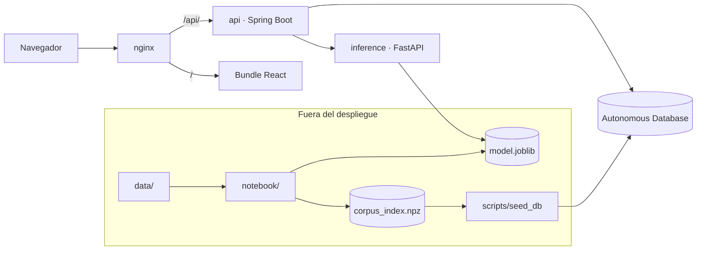
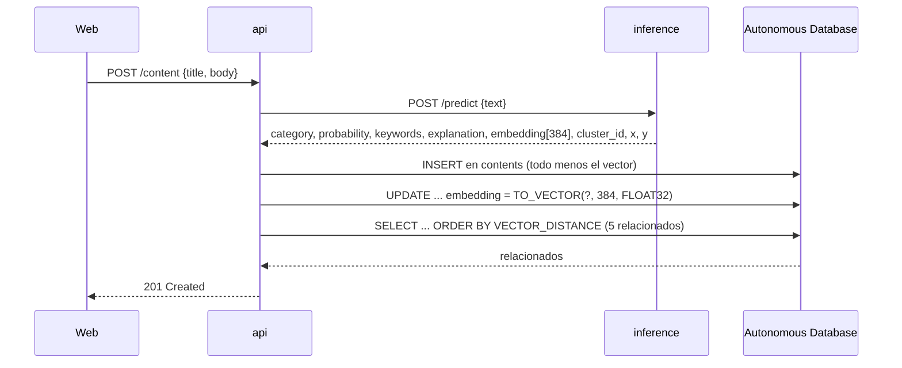
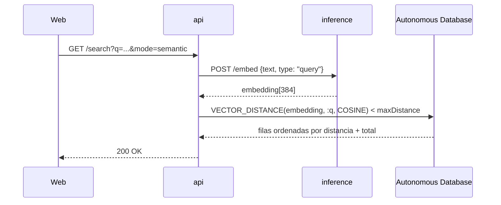

# Arquitectura

Mindloom son seis carpetas. Cuatro se despliegan, dos no.

| Carpeta | Qué hace | Se despliega |
|---|---|---|
| `web/` | La interfaz. Ingesta, búsqueda, listado, carga CSV y mapa | sí, como bundle servido por nginx |
| `api/` | Valida, orquesta y persiste. 10 endpoints | sí |
| `inference/` | Clasifica y vectoriza. 4 endpoints | sí |
| `notebook/` | Entrena y serializa `model.joblib` | no |
| `data/` | Construye el corpus | no |
| `scripts/` | Siembra la tabla `contents` desde el `.npz` | no, se corre a mano |

## Quién habla con quién

## Las cuatro fronteras

No son estilo, son reglas. Romper cualquiera de ellas rompe algo concreto.

1. **`web/` solo llama a `api/`.** Nunca a `inference/`. El navegador no tiene
   forma de llegar al puerto 8000, que no se publica.
2. **`api/` orquesta y persiste; no calcula.** No carga modelos ni hace
   aritmética de vectores. Cuando necesita un embedding, lo pide.
3. **`inference/` no toca la base.** No guarda nada entre peticiones. Lo único
   que mantiene en memoria es el artefacto.
4. **`notebook/` no se despliega.** Su salida son ficheros en el bucket.

## Ingesta de un contenido

El código tiene dos detalles que no se ven en el diagrama:

**Una sola llamada a inference.** `POST /predict` devuelve la categoría *y* el
embedding, el cluster y las coordenadas del mapa. Pedir el vector aparte
significaría pasar el encoder dos veces sobre el mismo texto, que es la parte
cara de todo el recorrido.

**El vector se escribe en una segunda sentencia.** JPA guarda la fila y después
un `UPDATE` con `TO_VECTOR` rellena la columna `VECTOR(384, FLOAT32)`
([ContentIngestionServiceImpl.java:61](../api/src/main/java/com/G9_LATAM_TEAM_58/techapi/inference/service/impl/ContentIngestionServiceImpl.java#L61)).
Hibernate no mapea el tipo `VECTOR`, así que esa columna queda fuera de la
entidad y se escribe con `JdbcTemplate`.

## Búsqueda semántica

El `minSimilarity` de la petición se convierte en `maxDistance = 1 - minSimilarity`
antes de bajar a la consulta. El total sale de un `COUNT` aparte, no del tamaño
de la página.

## Por qué la similitud se resuelve en la base

Los 17.000 vectores del corpus están en la columna `embedding` de `contents`, y
ahí es donde se comparan. `inference/` vectoriza; no busca.

La alternativa habría sido mantener el índice en memoria en Python. Se descartó
porque el corpus crece: cada contenido que entra por `POST /content` queda
indexado y es candidato a aparecer como relacionado en la siguiente búsqueda. Un
índice en memoria obligaría a reconstruirlo o a sincronizarlo con la base en cada
alta. En la base, el alta *es* la indexación.

## Qué rutas llaman a inference

Solo tres de las diez:

| Ruta de la API | Llama a |
|---|---|
| `POST /content` | `POST /predict` |
| `GET /search?mode=semantic` | `POST /embed` |
| `GET /model` | `GET /model/info` |

Las otras siete se resuelven con la base sola, incluida `GET /search?mode=keyword`
y `GET /contents/{id}/related`. Los relacionados no necesitan a inference porque
el contenido base ya tiene su vector guardado: el ranking es una consulta.

---
← [Índice de docs](README.md) · [Contratos](CONTRACTS.md)
