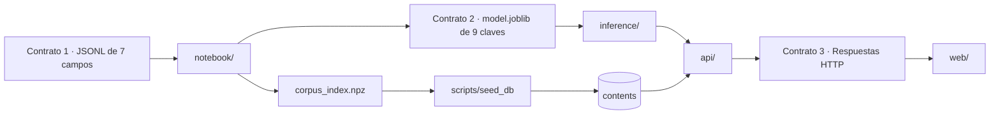

# Contratos

Tres fronteras donde una persona produce algo y otra lo consume. Cambiar
cualquiera de las tres por tu cuenta rompe el trabajo de alguien más.



## 1 · El esquema del corpus

Lo produce `data/`, lo consume `notebook/`. JSONL, un objeto por línea, siete
campos obligatorios:

```json
{"id":"...","title":"...","body":"...","category":"...","source":"...","url":"...","language":"es"}
```

JSONL y no CSV porque el texto técnico viene lleno de comas, comillas y saltos de
línea que rompen el parseo.

`source` y `language` no son decorativos: son columnas de `contents`, y el corpus
es la única pieza que puede emitirlos. Un fichero sin ellos deja dos columnas
vacías en la base para siempre.

## 2 · `model.joblib`

Lo produce `notebook/`, lo consume `inference/`. Nueve claves:

| Clave | Qué es |
|---|---|
| `meta` | versión, modelo de embeddings, `dim`, `feature_dim`, categorías, métricas |
| `classifier` | `LogisticRegression` sobre features híbridas → categoría |
| `svd` | `TruncatedSVD` que comprime el TF-IDF; `None` si está desactivado |
| `label_encoder` | `LabelEncoder` de las 8 categorías |
| `keyword_vectorizer` | `TfidfVectorizer` bilingüe, para las palabras clave |
| `baseline_vectorizer` | `TfidfVectorizer` del modelo explicable y entrada del SVD |
| `baseline_classifier` | `LogisticRegression` explicable, alimenta `explanation` |
| `kmeans` | asigna cluster a contenido nuevo |
| `umap_reducer` | proyecta contenido nuevo al mapa 2D |

`kmeans` y `umap_reducer` son modelos ajustados, no arrays precalculados. Esa es
la razón de que un contenido dado de alta hoy reciba sus coordenadas al vuelo.

### Dos dimensiones que no son intercambiables

Es el error más fácil de cometer en este contrato.

- **`dim` = 384.** El embedding. Es lo que viaja en las respuestas, lo que se
  guarda en `contents.embedding` y sobre lo que corre `VECTOR_DISTANCE`.
- **`feature_dim` = 884.** Lo que come el clasificador:
  `hstack([embedding, normalize(svd.transform(tfidf))])`.

Meter las features híbridas en la columna `VECTOR(384)` falla. Pasar el embedding
crudo al clasificador falla. `kmeans` y `umap_reducer` trabajan sobre el
embedding crudo, igual que la base, para que cluster, mapa y búsqueda vivan en el
mismo espacio.

Los vectores del corpus **no** van dentro del `.joblib`. Salen aparte en
`corpus_index.npz`, y de ahí a la tabla `contents`.

## 3 · Las respuestas de la API

Las produce `api/`, las consume `web/`.

Todo error tiene la misma forma, nunca un stacktrace:

```json
{ "error": "VALIDATION_ERROR", "message": "El parámetro 'size' no puede superar 100 (recibido: 500)", "timestamp": "2026-08-11T19:33:15.906538600Z" }
```

Tres códigos, y solo tres: `VALIDATION_ERROR`, `NOT_FOUND`, `INTERNAL_ERROR`.
Están en el enum [ErrorCode.java](../api/src/main/java/com/G9_LATAM_TEAM_58/techapi/common/exception/ErrorCode.java);
renombrar una constante es un cambio incompatible. El código no lleva el estado
HTTP pegado: `INTERNAL_ERROR` sale con 500 cuando falla una llamada a inference y
con 503 cuando el servicio no está conectado.

### La regla del idioma

Inglés en todo: rutas, claves JSON, códigos de error, nombres de campo. Español
en exactamente dos sitios que ve la persona usuaria: el `message` del error y los
valores de categoría (`"Backend"`, `"Datos e IA"`…).

`web/` es la única capa que traduce claves inglesas a etiquetas en español. Si
una traducción aparece en `api/` o en `inference/`, está en el sitio equivocado.

## Lo que hay que saber de los embeddings

**Los prefijos E5 son obligatorios.** El modelo es `intfloat/multilingual-e5-small`.
El contenido se codifica como `"passage: {texto}"` y las consultas como
`"query: {texto}"`. Mezclarlos no lanza ninguna excepción: solo devuelve peores
resultados, en silencio. Por eso `type` en `POST /embed` no tiene valor por
defecto — quien llama tiene que elegir.

**Están L2-normalizados y son float32.** Como la norma es 1, el coseno equivale
al producto escalar. No hay que volver a normalizar ni calcular similitudes en
Python: `VECTOR_DISTANCE(embedding, :q, COSINE)` en la base ya es la respuesta.

---
← [Índice de docs](README.md) · [Arquitectura](ARCHITECTURE.md)
