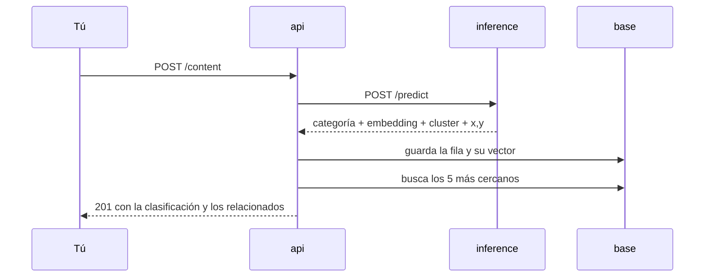
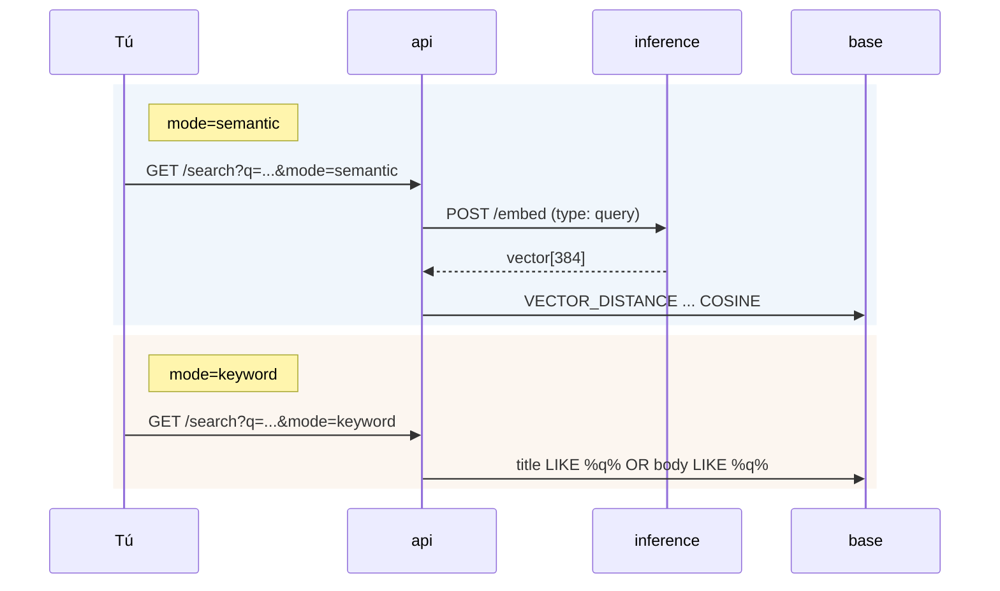
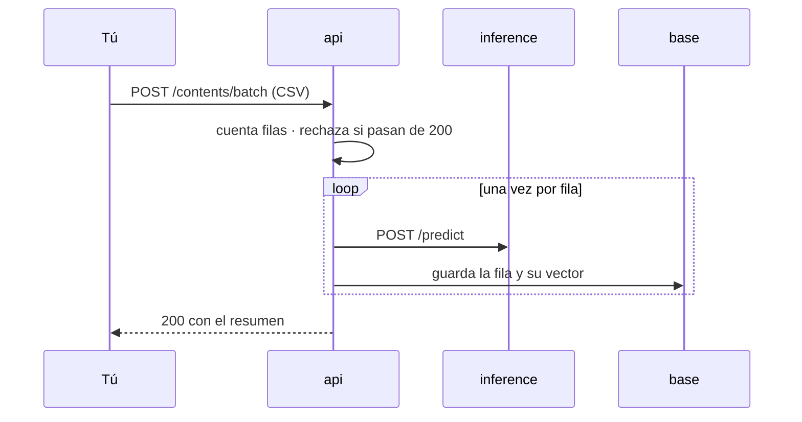

# Ejemplos de uso

Tres recorridos ejecutados contra el sistema. Las respuestas están pegadas tal
como salieron, sin recortar ni maquillar: por eso algunas probabilidades son
bajas y algún resultado es peor de lo que uno esperaría.

Las peticiones apuntan a `localhost:8080` con el stack levantado
(`docker compose up`). Contra el despliegue, el prefijo es
`https://mindloom.lat/api`.

## 1 · Dar de alta un contenido



```bash
curl -X POST http://localhost:8080/content \
  -H 'Content-Type: application/json' \
  -d '{
    "title": "Cuando conviene un indice parcial en PostgreSQL",
    "body": "Un indice parcial solo cubre las filas que cumplen una condicion WHERE. En tablas donde la mayoria de consultas filtran por un estado concreto, ocupa una fraccion del espacio de un indice completo y se mantiene mas barato en cada escritura."
  }'
```

```json
{
  "id": "usr-385b45da-dc64-4a5a-aea7-67e0b333228a",
  "category": "Bases de datos",
  "probability": 0.4589795262377676,
  "keywords": ["indice", "cubre", "cumplen", "parcial", "mantiene"],
  "explanation": ["where", "tablas", "consultas", "condicion", "estado"],
  "related": [
    { "id": "es-stackoverflow-14076", "title": "Uso correcto de indices múltiples para optimizar consultas", "category": "Bases de datos", "similarity": 0.8875669605990077 },
    { "id": "es-stackoverflow-281340", "title": "USO WHERE 1=1 SQL", "category": "Bases de datos", "similarity": 0.8666207661238199 },
    { "id": "es-stackoverflow-453050", "title": "Seleccionar por cadena parcial en varias columnas de un dataframe de pandas", "category": "Datos e IA", "similarity": 0.8664262205469808 }
  ]
}
```

La categoría es correcta con `probability` 0,46. No es un fallo: son 8 clases y
el texto toca índices, consultas y escrituras, así que la probabilidad se reparte
entre "Bases de datos" y sus vecinas. `keywords` sale del vectorizador TF-IDF;
`explanation` son los términos con más peso en la decisión del modelo explicable,
y por eso las dos listas no coinciden.

Desde este momento el documento está indexado. El ejemplo siguiente lo encuentra.

## 2 · Buscar, en los dos modos



La misma consulta, escrita como la escribiría una persona:

```bash
curl 'http://localhost:8080/search?q=que%20es%20un%20indice%20en%20base%20de%20datos&mode=semantic&size=3'
```

```json
{
  "mode": "semantic",
  "total": 17280,
  "elapsedMs": 1045,
  "results": [
    { "id": "usr-385b45da-dc64-4a5a-aea7-67e0b333228a", "title": "Cuando conviene un indice parcial en PostgreSQL", "category": "Bases de datos", "similarity": 0.8760408665519566 },
    { "id": "es-stackoverflow-359707", "title": "¿Es correcto este codigo para declarar un indice tipo clustered (agrupado) en SQL Server Management Studio?", "category": "Bases de datos", "similarity": 0.8660045047995744 },
    { "id": "devto-4069894", "title": "Cómo construir un agente de IA que \"habla\" con tu base de datos SQL", "category": "Bases de datos", "similarity": 0.8640498688213555 }
  ]
}
```

Y ahora la misma cadena en el otro modo:

```bash
curl 'http://localhost:8080/search?q=que%20es%20un%20indice%20en%20base%20de%20datos&mode=keyword&size=3'
```

```json
{ "mode": "keyword", "total": 0, "elapsedMs": 3885, "results": [] }
```

**Cero resultados, y tardó casi cuatro veces más.** El modo `keyword` hace
`title LIKE %q% OR body LIKE %q%`
([ContentRepository.java](../api/src/main/java/com/G9_LATAM_TEAM_58/techapi/domain/ContentRepository.java)),
así que busca la frase completa como subcadena literal. Ningún documento del
corpus contiene "que es un indice en base de datos" escrito así de seguido.

Con una sola palabra sí encuentra:

```bash
curl 'http://localhost:8080/search?q=indice&mode=keyword&size=3'
```

```json
{
  "mode": "keyword",
  "total": 69,
  "elapsedMs": 3585,
  "results": [
    { "id": "es-stackoverflow-246685", "title": "problem to return an ee.image in api python EE", "category": "Backend", "similarity": 1 },
    { "id": "es-stackoverflow-500506", "title": "Closure en javascript", "category": "Fundamentos", "similarity": 1 },
    { "id": "devto-3375240", "title": "fractional-indexing: Implementing Drag-and-Drop Ordering and Avoiding Index Collisions", "category": "Fundamentos", "similarity": 1 }
  ]
}
```

69 documentos que contienen la cadena "indice" en alguna parte, sin orden de
relevancia: el primero es una pregunta sobre Python. `similarity` vale 1 en todos
porque una coincidencia literal no tiene grado.

Es la comparación que justifica el proyecto entero. El modo semántico entiende
la pregunta; el literal solo compara caracteres.

## 3 · Cargar un CSV



Un CSV con cabecera `title,body`:

```csv
title,body
"Rate limiting con Redis","Un contador por ventana deslizante en Redis limita cuantas peticiones acepta una API por cliente y minuto, sin guardar estado en el proceso."
"Migraciones reversibles","Una migracion que no se puede revertir obliga a restaurar una copia de seguridad para deshacerla, y eso convierte cualquier despliegue fallido en una parada larga."
```

```bash
curl -X POST http://localhost:8080/contents/batch -F "file=@ejemplo.csv"
```

```json
{
  "processed": 2,
  "failed": 0,
  "ids": [
    "usr-052cacb3-2a53-4518-96df-50d777157b04",
    "usr-a5130d79-609f-40e8-823a-7f71efac3e1c"
  ],
  "errors": [],
  "byCategory": { "Bases de datos": 1, "Seguridad": 1 }
}
```

Clasificó "Rate limiting con Redis" como Seguridad y "Migraciones reversibles"
como Bases de datos.

El bucle del diagrama es la razón del tope de 200 filas: cada fila cuesta una
llamada al modelo, y el límite de 5 MB no acota ese trabajo porque las filas
cortas son baratas de enviar y caras de procesar. Un archivo con 201 filas se
rechaza entero, sin guardar ninguna:

```json
{ "error": "VALIDATION_ERROR", "message": "El archivo tiene 201 filas y el máximo es 200. Divídelo en varios archivos.", "timestamp": "2026-08-11T19:34:02.309631454Z" }
```

---
← [Índice de docs](README.md) · [Arquitectura](ARCHITECTURE.md)
