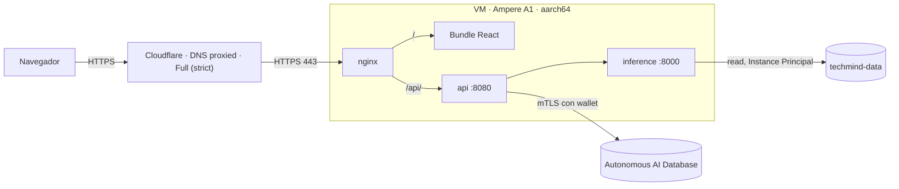
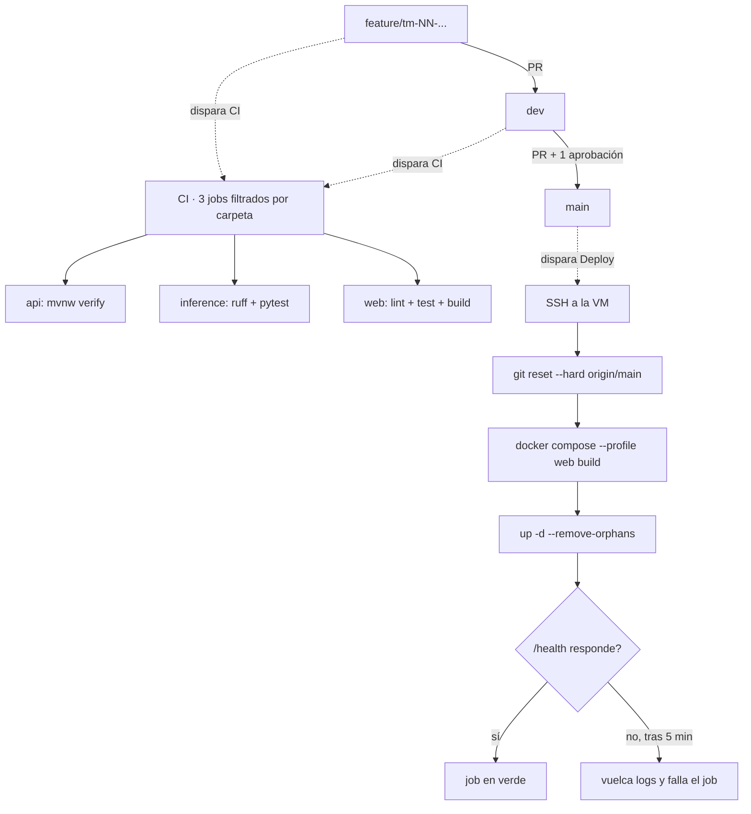

# Infraestructura

Todo vive en Oracle Cloud Infrastructure, región **Brazil East (São Paulo)**,
compartment `techmind`. Cuatro recursos:

| Recurso | Qué es |
|---|---|
| Compute | `VM.Standard.A1.Flex`, 2 OCPU / 12 GB, Ubuntu 24.04 **aarch64**, marcada Always Free |
| Autonomous AI Database | `techmind`, Transaction Processing, versión **26ai**, marcada Always Free |
| Object Storage | bucket `techmind-data`, artefactos bajo `models/v1/` |
| Dominio | `mindloom.lat`, con Cloudflare delante |

La VM corre los tres contenedores con Docker Compose. No hay contenedor de base
de datos: la persistencia es la Autonomous AI Database gestionada.

## El camino de una petición



**Qué está abierto y qué no.** Solo 80 y 443 se publican al exterior. Los puertos
`8080` de la API y `8000` de inference usan `expose`, no `ports`: existen dentro
de la red de Compose y no se pueden alcanzar desde fuera. El 80 no sirve la
aplicación, devuelve `301` a HTTPS.

**El registro DNS está en modo *proxied*** (nube naranja), así que el tráfico
pasa por Cloudflare de verdad. El cifrado está en **Full (strict)**, que exige
que el origen presente un certificado válido: por eso nginx escucha en 443 con el
Certificado de Origen montado desde `./certs`, en lugar de servir HTTP plano.
*Always Use HTTPS* está activado en el borde.

TLS termina dos veces. Navegador contra Cloudflare, y Cloudflare contra nginx.

## Cómo llega el código a la VM



Nadie hace push a `main`. El despliegue arranca cuando se fusiona el PR de `dev`,
que es lo que GitHub registra como un push sobre esa rama. CI corre dos veces
antes de eso: al abrir el PR contra `dev` y al abrirlo contra `main`.

**Se construye en la VM, no en el runner.** La VM es aarch64 y los runners de
GitHub son x86; una imagen x86 en esa máquina falla al arrancar con
`exec format error`. Compilar con QEMU en el runner funciona, pero tarda mucho
más una vez que el transformer está horneado en la imagen.

**La prueba de humo tiene la última palabra.** Tras levantar los contenedores, el
job consulta `/health` desde dentro del contenedor de la API —el 8080 no está
publicado, así que no se puede consultar desde el host— y reintenta hasta 30
veces cada 10 segundos. Si en cinco minutos no responde, vuelca los últimos 50
logs de `api` e `inference` y falla. Sin ese paso, un despliegue que deja el
sitio caído terminaba en verde.

El deploy también se puede lanzar a mano desde la pestaña Actions
(`workflow_dispatch`), y `concurrency: deploy-vm` impide que dos se solapen.

## Cómo se autentica inference contra el bucket

Sin claves en la VM. Un **dynamic group** llamado `techmind-vms` agrupa las
instancias del compartment `techmind`, y la policy `techmind-instance-principal`
le concede exactamente dos permisos:

```
Allow dynamic-group techmind-vms to read objects in compartment techmind
Allow dynamic-group techmind-vms to read buckets in compartment techmind
```

Solo `read`. El contenedor puede descargar `model.joblib` y no puede
sobrescribirlo, aunque el código tuviera un fallo que lo intentara.

Al arrancar, `inference/` lee `models/latest.txt`, que contiene el prefijo activo
(`models/v1/`), y de ahí descarga el artefacto.

## Levantarlo en tu máquina

Instance Principal solo funciona dentro de una instancia de OCI. Fuera, el
firmante no alcanza el endpoint de metadatos y el contenedor no arranca. Para
desarrollar en local hacen falta dos cosas que no están en el repo: una copia de
`model.joblib` y el wallet descomprimido.

Ambas se declaran en `docker-compose.override.yml`, que Docker Compose fusiona
solo y que está fuera del control de versiones porque contiene rutas de una única
máquina:

```yaml
services:
  inference:
    ports: ["8000:8000"]
    environment:
      MODEL_LOCAL_PATH: /model/model.joblib
    volumes:
      - "/ruta/a/tu/carpeta:/model:ro"

  api:
    ports: ["8080:8080"]
    environment:
      SPRING_DATASOURCE_URL: jdbc:oracle:thin:@techmind_tp?TNS_ADMIN=/app/wallet
    volumes:
      - "/ruta/a/tu/wallet:/app/wallet:ro"
```

`TNS_ADMIN` apunta a `/app/wallet` y no a una carpeta de tu disco: el contenedor
no ve rutas del host.

Falta un paso más. La base tiene la **lista de control de acceso habilitada**, así
que rechaza cualquier conexión desde una IP que no esté en ella. Para conectar
desde fuera de la VM hay que añadir tu IP pública en la ficha de la base, sección
*Network*.

---
← [Índice de docs](README.md) · [Cuando algo falla](RUNBOOK.md)
